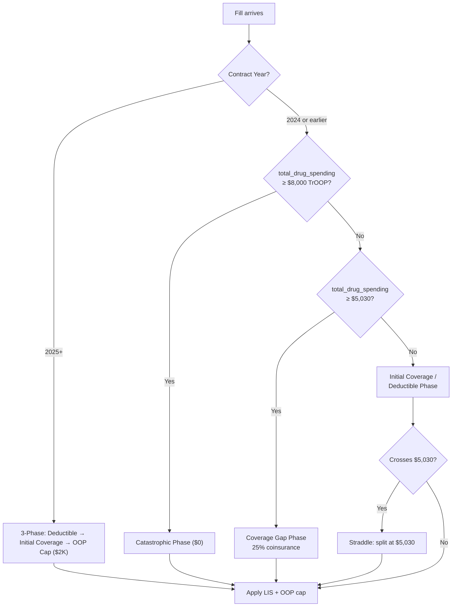

# Phase 1 Walkthrough: Coverage Gap & Catastrophic Phase Enhancement

## CMS Constant References & Year-by-Year Rules

> [!CAUTION]
> **Critical finding:** The Inflation Reduction Act (IRA) **eliminated the coverage gap (donut hole) starting in 2025**. The benefit structure changed significantly between 2024 and 2025. The constants I used are **2024 values** — they are still useful if the project's source data (SPUF files) is from CY2024 or earlier quarters, but they should NOT apply to 2025+ data.

### Year-by-Year Benefit Phase Matrix

| Parameter | CY2024 | CY2025 | CY2026 |
|-----------|--------|--------|--------|
| **Max Deductible** | $545 | $590 | $615 |
| **Initial Coverage Limit** | $5,030 | ❌ *eliminated* | ❌ *eliminated* |
| **Coverage Gap (Donut Hole)** | ✅ 25% coinsurance | ❌ *eliminated* | ❌ *eliminated* |
| **Catastrophic TrOOP Threshold** | $8,000 | ❌ *eliminated* | ❌ *eliminated* |
| **Catastrophic Cost-Sharing** | $0 (since 2024) | N/A | N/A |
| **Annual OOP Cap** | $8,000 TrOOP | **$2,000** | **$2,100** |
| **Post-OOP-Cap Cost** | $0 | $0 | $0 |

### Simplified 2025+ Structure (3 phases only)
```
Deductible → Initial Coverage → OOP Cap ($2,000) → $0 for rest of year
```

### 2024 Structure (4 phases — what we modeled)
```
Deductible → Initial Coverage → Coverage Gap (25%) → Catastrophic ($0)
```

---

## Constant Sources & References

### Already Correct (existing in codebase)

| Constant | Value | Source |
|----------|-------|--------|
| `ANNUAL_OOP_CAP` | $2,000 | [CMS 2025 Part D Redesign](https://www.cms.gov/newsroom/fact-sheets/inflation-reduction-act-and-medicare) — IRA §1193 |

### 2024-Era Constants (what we added)

| Constant | Value | CMS Source | Applies To |
|----------|-------|-----------|------------|
| `INITIAL_COVERAGE_LIMIT` | $5,030 | [CMS 2024 Part D Benefit Parameters](https://www.cms.gov/files/document/2024-medicare-part-d-benefit-parameters.pdf) | **CY2024 only** |
| `CATASTROPHIC_TROOP_THRESHOLD` | $8,000 | Same CMS 2024 parameters document | **CY2024 only** |
| `COVERAGE_GAP_GENERIC_COINSURANCE` | 25% | [42 CFR §423.104(d)(5)](https://www.ecfr.gov/current/title-42/chapter-IV/subchapter-B/part-423/subpart-C/section-423.104) — standard benefit design | **CY2024 and earlier** |
| `COVERAGE_GAP_BRAND_COINSURANCE` | 25% | Same CFR section — after manufacturer discount | **CY2024 and earlier** |
| `CATASTROPHIC_GENERIC_COPAY` | $4.50 | [2024 CMS Part D Benefit Parameters](https://www.cms.gov/files/document/2024-medicare-part-d-benefit-parameters.pdf) | **CY2024 only** (eliminated 2024+) |
| `CATASTROPHIC_BRAND_COINSURANCE` | 5% | Same — was 5% prior to IRA | **CY2023 and earlier** (was $0 in 2024) |
| `CATASTROPHIC_BRAND_MAX_COPAY` | $44.00 | Same — applied to pre-IRA catastrophic | **CY2023 and earlier** |

### Key CMS Official References

1. **CMS 2024 Part D Benefit Parameters memo** — Annual announcement setting ICL, TrOOP, deductible for CY2024
   - Source: [cms.gov](https://www.cms.gov/medicare/payment/drug-plans-cms/part-d/benefit-parameters)
2. **Inflation Reduction Act §11201 (Part D Redesign)** — Eliminated coverage gap effective 1/1/2025, set $2,000 OOP cap
   - Source: [congress.gov - H.R.5376](https://www.congress.gov/bill/117th-congress/house-bill/5376)
3. **CMS 2025 Final Part D Redesign Program Instructions** — Implementing the redesigned 3-phase benefit
   - Source: [cms.gov](https://www.cms.gov/medicare/prescription-drug-coverage/prescriptiondrugcovgenin)
4. **CMS 2026 Rate Announcement** — $2,100 OOP cap, $615 max deductible for CY2026
   - Source: [cms.gov](https://www.cms.gov/medicare/payment/medicare-advantage-rates-statistics/announcements-and-documents)

---

## What This Means For The Engine

> [!IMPORTANT]
> **Decision needed:** The correct behavior depends on which contract year the source data (SPUF files) represents.

### Option A: Auto-detect from data (Recommended)
Make the engine read `CONTRACT_YEAR` from `bronze.basic_formulary` and apply the correct benefit structure:
- **CY2024 or earlier**: Apply all 4 phases (deductible → initial coverage → gap → catastrophic)
- **CY2025+**: Apply 3 phases only (deductible → initial coverage → $0 after OOP cap)

### Option B: Configurable year parameter
Add a `contract_year` parameter to `BeneficiaryInput` and use it to select the correct constants.

### Option C: Keep 2024 coverage gap logic for research purposes
The coverage gap modeling is still valuable for:
- Analyzing historical data (2024 and prior)
- Understanding what-if scenarios ("what would costs look like under the old benefit structure?")
- Prior-year plan comparisons (Phase 8)

---

## Files Modified

### [recommend.py](file:///d:/STUDY/PRACTICE/autoresearch/autoresearch-win-rtx/CMS-MPD-Recommendation/src/cms_mpd/recommend.py)

render_diffs(file:///d:/STUDY/PRACTICE/autoresearch/autoresearch-win-rtx/CMS-MPD-Recommendation/src/cms_mpd/recommend.py)

### [test_contracts.py](file:///d:/STUDY/PRACTICE/autoresearch/autoresearch-win-rtx/CMS-MPD-Recommendation/tests/test_contracts.py)

render_diffs(file:///d:/STUDY/PRACTICE/autoresearch/autoresearch-win-rtx/CMS-MPD-Recommendation/tests/test_contracts.py)

### [test_phase1_coverage_gap.py](file:///d:/STUDY/PRACTICE/autoresearch/autoresearch-win-rtx/CMS-MPD-Recommendation/tests/test_phase1_coverage_gap.py) [NEW]

20 tests across 7 test classes covering all phase transitions.

## Testing

```
24 passed in 0.76s
```

## Phase Detection Logic


