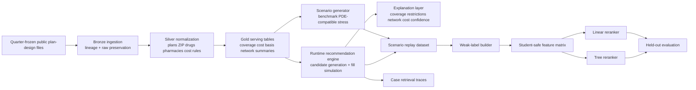
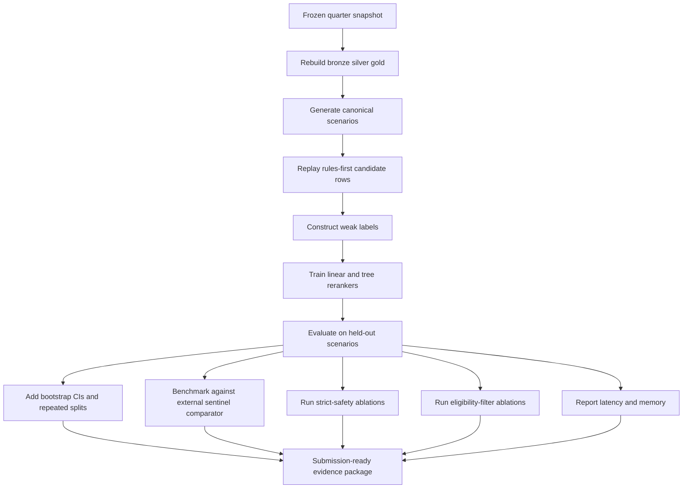

# Deep Review of the CMS-MPD-Recommendation Submission Draft

## Executive summary

My bottom-line view is that this is a strong **software-methods** manuscript with a real contribution, but it is **not yet ready for journal submission**. The draft itself identifies the current state as a reviewer-focused submission-preparation rewrite, and the code-availability section explicitly says the software still needs to be archived as a versioned public release with a DOI, dependency lockfile, and one-command table/figure regeneration workflow. fileciteturn0file0L17-L18 fileciteturn0file0L1001-L1003

The strongest parts are the manuscript’s explicit separation between public plan-design inputs and the PDE-compatible local layer, the deterministic rules-first pipeline with auditable explanation traces, the scenario-held-out evaluation design, and the unusually candid discussion of unresolved guardrails. Those are exactly the kinds of features that make the work interesting as biomedical software rather than as a generic recommender paper. fileciteturn0file0L58-L65 fileciteturn0file0L83-L132 fileciteturn0file0L301-L346 fileciteturn0file0L648-L764 fileciteturn0file0L860-L866

The biggest weaknesses are mostly about **submission readiness and evidentiary strength**, not about whether the project is interesting. The title page still contains placeholders; the listed article type does not match the journal’s published article-type menu; the code is not yet archived as a citable release; the main evaluation remains internal because the weak labels and comparators are derived from the same rules-first ecosystem; uncertainty estimates are not reported; and the paper’s own safety guardrail shows that uncovered-drug burden worsened under the tree reranker in aggregate, especially in specialty-heavy bundles. fileciteturn0file0L26-L32 fileciteturn0file0L819-L820 fileciteturn0file0L845-L864 fileciteturn0file0L975-L991 fileciteturn0file0L1001-L1003 citeturn17view2turn17view0

The readiness judgment below synthesizes the draft’s self-description, methods, results, limitations, and the journal guide.

| Dimension | Assessment | Practical meaning |
|---|---|---|
| Scientific/software contribution | Strong | Worth submitting after major revision |
| Journal fit | Good, if reframed as a methodology/software article | Emphasize biomedical software contribution over policy exposition |
| Reproducibility | Partial | Good internal locking, but not yet archival or externally reproducible |
| Evaluation strength | Moderate | Internal validity is solid; external validity is still limited |
| Submission readiness | Not ready | I would revise before submission |

## Submission readiness and journal fit

The fit with *Computer Methods and Programs in Biomedicine Update* is real. The journal says it welcomes innovative computing methodologies and software systems research across biomedical informatics, data-driven care, consumer health, and public health, and it explicitly includes **Methodology Article** among its article types. This manuscript’s strongest identity is precisely an explainable, policy-aware, biomedical decision-support pipeline rather than a policy commentary or a pure machine-learning paper. citeturn17view2turn0view1

That said, the draft is not yet aligned cleanly enough with the journal’s formal submission requirements. The title page still has placeholder authors, affiliations, and corresponding-author information, while the paper labels itself as an “Original software and methods article,” which is not one of the journal’s listed article types. The guide also asks titles to be concise and to avoid abbreviations where possible, which makes the project acronym in the title a mild but real editorial risk. fileciteturn0file0L22-L32 citeturn17view0turn17view2

Formatting compliance is otherwise better than average for a pre-submission draft. The paper already includes highlights, abstract, keywords, data availability, code availability, ethics, funding, competing interests, CRediT, generative-AI disclosure, and acknowledgements, which maps well to the journal checklist. The journal also encourages a data statement, data linking, and research-object linkage for software and methods; that is a particularly important match for this manuscript because the software artifact is central to the claim. fileciteturn0file0L34-L48 fileciteturn0file0L997-L1031 citeturn17view2turn17view3turn2view1

One important accessibility gap remains. The journal asks authors to provide a glossary of field-specific terms, and this manuscript uses dense domain shorthand such as LIS, PDE, MA-PD, SNP, NDC, RXCUI, UM, and OOP throughout the methods and discussion. Adding a short glossary would materially improve readability for reviewers coming from biomedical computing rather than U.S. Medicare policy. fileciteturn0file0L307-L317 fileciteturn0file0L969-L973 citeturn17view1

The policy relevance is also well grounded. entity["organization","MedPAC","us medicare advisory body"] describes Part D choice as a market where beneficiaries compare plan coverage, premiums, cost sharing, pharmacy networks, and quality, and it specifically notes that Plan Finder pricing accuracy and pharmacy-network access remain important operational concerns. That makes the manuscript’s emphasis on explainability, network/access summaries, and visible evidence gaps substantively well motivated rather than decorative. citeturn16view0turn16view1turn16view3turn16view4

## Manuscript critique

**Novelty.** The novelty is real, but it is primarily **systems novelty** rather than algorithmic novelty. The manuscript’s core contribution is a tightly integrated pipeline that goes from provenance-constrained public CMS files, to bronze/silver/gold tables, to deterministic fill-level cost simulation, to explanation generation, to constrained reranking over already simulated candidates. Algorithmically, the learned layer is intentionally modest: ridge regression and a shallow additive tree model. That is not a weakness by itself, but the paper should say more explicitly that the novelty lies in the auditable software architecture and policy-aware evidence model, not in inventing a new ranking algorithm. fileciteturn0file0L138-L170 fileciteturn0file0L301-L346 fileciteturn0file0L481-L519

**Literature context.** The related-work section is thoughtful and unusually well connected to beneficiary choice, explanation, and post-IRA policy change. Still, it remains too diffuse for a journal audience unless it is sharpened around a simpler question: *what existing software or decision-support workflows does this system do that other tools do not?* The absence of a frozen external comparator is the main reason the literature/context section still feels incomplete. Because the manuscript itself says a matched Medicare Plan Finder comparator has not yet been packaged, the paper cannot yet fully demonstrate external face validity. The literature section would be stronger with a compact comparison table contrasting this system against Plan Finder-style cost comparison, standard plan-ranking heuristics, and prior decision-aid studies. fileciteturn0file0L67-L77 fileciteturn0file0L646-L658 fileciteturn0file0L987-L989 citeturn16view1

**Clarity and structure.** The manuscript is rigorous, but too dense in its current form. The mathematical exposition is well done, yet the paper includes long relational and ranking formulations in multiple sections. For a biomedical software venue, I would keep the key equations that define the rules engine, the weak label, and the guardrail-constrained ranker, but move the more implementation-near relational algebra and some metric formalism into an appendix or supplementary methods. That would preserve rigor while improving reviewer throughput. The same is true for the eight-case retrieval section, which is useful but overextended. fileciteturn0file0L236-L296 fileciteturn0file0L348-L595 fileciteturn0file0L876-L943 citeturn2view5turn17view1

**Methodology and experimental design.** The methodological design is stronger than many applied recommender papers. The held-out-by-scenario split is appropriate and materially better than row-random splitting; the scenario bundles are well chosen; and the paper is commendably explicit that the weak label is not a clinical gold standard. The main methodological weakness is that the label, features, and evaluators live inside the same ecosystem. Even with the `student_safe` feature policy, there is still a substantial circularity risk because the weak label is authored from the deterministic teacher’s preference structure and includes terms derived from the same simulation logic used to create the candidate rows. That means the evaluation is good evidence of **internal alignment**, but not strong evidence of external correctness. The paper says this in words; the revision should make it even harder for readers to miss. fileciteturn0file0L519-L537 fileciteturn0file0L541-L595 fileciteturn0file0L642-L658 fileciteturn0file0L979-L983

**Statistical analysis.** The chosen metrics are reasonable and carefully defined, especially the separation between ranking agreement and safety/operational metrics. What is missing is **uncertainty quantification**. The paper reports point estimates for Top-1, overlap, NDCG, and uncovered burden, but no bootstrap confidence intervals, no repeated-split variability, and no paired significance assessment at the scenario level. The manuscript also exposes only one generator seed in the reproducibility lock and does not discuss training-seed stability. For a methods article, this is an avoidable weakness. fileciteturn0file0L176-L183 fileciteturn0file0L660-L764 fileciteturn0file0L809-L843

**Results interpretation.** The paper is directionally convincing, but the strongest reviewer-facing result is not just that the tree reranker improved Top-1 and NDCG. It is that those gains came with a worsening in uncovered-drug burden, concentrated in specialty-high-cost and mixed-restriction bundles. That is exactly the kind of tradeoff that should move from the middle of the Results section into the abstract-level message and conclusion-level framing. Right now the manuscript does acknowledge it, but the positive metric movement still gets more rhetorical weight than the safety tradeoff. I would rebalance that. fileciteturn0file0L813-L820 fileciteturn0file0L847-L864 fileciteturn0file0L957-L963

**Limitations and ethics.** The limitations section is one of the strongest parts of the draft. It correctly states that the evaluation is internal and scenario-based, that public files do not reveal all economic truth, and that the PDE-compatible layer is not equivalent to unrestricted PDE access. The ethics statement is also appropriate as written because it explains why IRB review was not required. The remaining gap is provenance clarity for the local PDE-compatible sample and study-side enrichments. Reviewers will want a sharper statement about whether `pde.csv` is synthetic, de-identified, schema-mimicking only, or derived under some governed mechanism, and what exactly can be shared publicly. fileciteturn0file0L103-L115 fileciteturn0file0L975-L991 fileciteturn0file0L999-L1007 citeturn17view2

## Reproducibility and repository assessment

A true file-by-file audit of the user-provided branch was **not possible in this environment because the branch URL was not retrievable here**. The repository assessment below is therefore the strongest evidence-based review I can provide from the draft’s explicit software descriptions, artifact locks, and code-availability statement.

What is already good is substantive. The manuscript documents pinned runtime dependencies, locked experiment identifiers, a quarter-frozen snapshot, medallion-layer tables, canonical keys, and a runtime contract centered on `gold.plan_drug_cost_basis` and related serving tables. That is a much better starting point than a vague “code available upon request” statement. The draft also correctly states that the manuscript, dataset metadata, and code constants are intended to be synchronized. fileciteturn0file0L172-L185 fileciteturn0file0L187-L234 fileciteturn0file0L321-L329

The major reproducibility weakness is that the artifact is still described as a **local workspace** rather than as an archival release. The paper says a tagged public release with DOI, dependency lockfile, and one-command regeneration script should be created before submission. It also mentions `pytest` in pinned dependencies, but it does not describe any unit tests, integration tests, regression tests, CI pipeline, release manifest, package metadata, container image, software license, or citation file. From a reviewer’s perspective, that means the project is *well specified conceptually* but not yet *reproducible operationally*. fileciteturn0file0L174-L185 fileciteturn0file0L1001-L1003

The data boundary is explicit but not yet fully reusable. The paper clearly distinguishes public quarterly inputs from local enrichments and the PDE-compatible layer. That is excellent scientific hygiene. But for replication, a reviewer still needs to know which local enrichments can be rebuilt automatically, which are packaged fixtures, which are optional, and which cannot be redistributed. That documentation is not yet complete in the draft’s availability language. entity["organization","Centers for Medicare & Medicaid Services","us health agency"] delivers the public quarterly plan-design files, but the rebuild story for `pde.csv`, `us_zipcode_geo.csv`, and insulin/reference artifacts still needs to be more operationalized. fileciteturn0file0L83-L132 fileciteturn0file0L997-L1003

The manuscript also does not yet provide computational-efficiency evidence. We know the artifact size and the evaluation design, but not the build time per snapshot, memory footprint, inference latency per beneficiary request, or the incremental overhead of reranking compared with rules-only execution. For a software-methods paper, at least a compact benchmark table would materially improve credibility. fileciteturn0file0L321-L327 fileciteturn0file0L797-L807

The inferred software architecture below reconstructs the likely module boundaries from the manuscript’s software description.

The code-change table below is therefore framed as **current state from available evidence** versus **recommended reproducibility hardening**.

| Current state from available evidence | Recommended change | Why it matters | Priority |
|---|---|---|---|
| `requirements.txt` and pinned package versions are documented in the manuscript | Add `pyproject.toml` or equivalent, plus a locked environment (`uv.lock`, `poetry.lock`, or `conda-lock`) and a minimal `Dockerfile` | Rebuilds become deterministic across machines | High |
| Local workspace is described, but archival release is still pending | Create a tagged public release with DOI, `CITATION.cff`, changelog, and release manifest | Converts a draft codebase into a citable research artifact | High |
| One-command regeneration is explicitly still a future task | Add `make reproduce` or a single CLI entry point to rebuild tables/figures from the frozen snapshot | Reviewer and editor reproducibility | High |
| `pytest` is pinned, but no test strategy is described | Add unit tests, integration tests, and regression tests with synthetic fixtures | Prevents silent breakage in joins, benefit logic, and ranking constraints | High |
| Safety constraints are described in prose and equations | Add regression tests for “no cross-bucket promotion,” match-confidence stop rules, and uncovered-burden guardrails | The highest-risk logic should be machine-enforced, not manuscript-enforced | High |
| Public/local data boundary is explicit but operationally incomplete | Add a provenance document and scripts that rebuild all shareable enrichments, plus stub fixtures for non-shareable layers | Makes the public boundary executable | High |
| No CI pipeline is documented | Add GitHub Actions for linting, tests, artifact checksums, and reproducibility smoke tests | Keeps the branch reliable during revision | Medium |
| No performance benchmarks are reported | Add benchmark scripts for snapshot build time, per-request latency, and peak memory | Software-method papers benefit from scale evidence | Medium |

## Missing experiments and analyses

The current study answers an important internal question — whether a constrained learned reranker can improve scenario-held-out ranking over a rules-first baseline — but it does not yet answer the strongest external-review questions. Those missing analyses are clear from the methods, results, limitations, and discussion. fileciteturn0file0L642-L764 fileciteturn0file0L809-L864 fileciteturn0file0L963-L991

| Recommended experiment or analysis | Why it matters | Expected outcome if the current story is correct | Priority |
|---|---|---|---|
| Frozen sentinel-case benchmark against Medicare Plan Finder or another external quarter-matched comparator | Establishes external face validity beyond self-generated weak labels | Rules/hybrid rankings should remain competitive on standard cases, while explanation fields should show added value on network/restriction-heavy cases | High |
| Scenario-level bootstrap confidence intervals and paired comparisons for Top-1, NDCG@5, AvgUncovered, and blocker precision | Distinguishes signal from noise | Tree reranker gains should remain positive, but specialty-bundle uncertainty will likely widen | High |
| Repeated-split and repeated-seed stability study | Current evidence relies on one main split and one generator seed | Aggregate ranking gains should be stable; uncovered-burden tradeoff may vary more by bundle | High |
| Weak-label coefficient perturbation / sensitivity analysis | Tests circularity and robustness of label-engineered supervision | Global win of the tree model should persist under modest weight shifts, but specialty guardrails may prove weight-sensitive | High |
| Strict-safety reranker ablation that hard-penalizes uncovered burden or forbids promotion when uncovered risk rises | Directly targets the failed guardrail | Slight decrease in NDCG/Top-1, but a better uncovered-burden profile in mixed-restriction and specialty bundles | High |
| Eligibility-filter experiment for MA-PD, D-SNP, and C-SNP constraints | The discussion itself notes these filters are needed before deployment-like use | Candidate sets will narrow and some current top plans will change, improving practical realism | High |
| Counterexample case set with deductible triggers, non-zero beneficiary OOP, OOP-cap triggering, and no-full-coverage scenarios | Current sample cases overemphasize zero-cost top rows | Better demonstration of the simulator’s full operating envelope | Medium |
| Runtime and scaling benchmark table | Needed for a software-method paper | Rules-first simulation likely dominates runtime; reranking overhead should be small | Medium |
| Robustness study for ambiguous medication inputs and unknown-network conditions | Safety claims depend on these edge cases | Manual-review flags should meaningfully reduce unsafe recommendations; unknown-network scenarios should be clearly surfaced | Medium |
| Small counselor-facing usability pilot | Explanation is central to the product claim | Trust and interpretability should improve, even if rank metrics remain unchanged | Medium |

The implied experimental workflow that would best strengthen the paper is:

## Revision plan and suggested pull requests

The revision plan should be driven by the distinction between **interesting science** and **submittable science**. The manuscript already has the former. It still needs the latter. fileciteturn0file0L17-L18 fileciteturn0file0L963-L991 fileciteturn0file0L1001-L1003

### Prioritized checklist

| Priority | Revision item | Why it is priority-ranked this way |
|---|---|---|
| High | Complete the title page and replace all placeholders | Submission-blocking administrative issue |
| High | Select a journal-listed article type and retitle more cleanly | Prevents immediate editorial friction |
| High | Archive the exact code state as a public release with DOI, license, lockfile, and single-command reproduction | Core reproducibility requirement for a software paper |
| High | Add an external comparator and uncertainty intervals | Biggest scientific credibility upgrade |
| High | Reframe performance claims around the failed uncovered-drug guardrail | Prevents overclaiming |
| High | Clarify the PDE-compatible layer’s provenance, shareability, and governance | Key ethics/reproducibility ambiguity |
| Medium | Add glossary, streamline dense equations, and shorten the case-retrieval narrative | Improves reviewer readability |
| Medium | Add eligibility filters and safety regression tests | Strengthens practical realism and trustworthiness |
| Medium | Add runtime/memory benchmarks | Useful for a methods/software readership |
| Low | Tighten title/keywords stylistically and package highlights as a separate file | Helpful polish, not core science |
| Low | Consider a co-submission to MethodsX or Data in Brief | Helpful for reproducibility visibility, but not required |

The manuscript-edit table below synthesizes the main textual revisions implied by the draft and the journal guide. fileciteturn0file0L22-L32 fileciteturn0file0L945-L1007 citeturn17view0turn17view1turn17view2turn17view3

### Current versus recommended manuscript edits

| Current manuscript state | Recommended revision |
|---|---|
| Title uses project acronym and the title page lists “Original software and methods article” | Retitle more descriptively and choose **Methodology Article** unless the editor suggests otherwise |
| Title page still contains TODO placeholders for authors, affiliations, and corresponding author | Complete all metadata before submission |
| Strong systems contribution is present, but novelty is not explicitly framed as systems/software novelty | State early that the main contribution is an auditable biomedical software pipeline, not a new high-capacity recommender |
| Related work is broad but comparator positioning is diffuse | Add a compact comparison table: Plan Finder / heuristic comparator / this pipeline |
| Methods are rigorous but very dense | Move part of the formalism to appendix or supplement; keep the key equations in the main text |
| Evaluation is honest but still mainly internal | Add external benchmarking, uncertainty intervals, and stability analyses |
| Results emphasize metric gains more than safety tradeoffs | Elevate the uncovered-burden worsening into the abstract, discussion, and conclusion framing |
| Sample cases show many zero-OOP top plans | Add sentinel examples with non-zero OOP, deductible effects, OOP-cap behavior, and no-full-coverage cases |
| Data/code statements are directionally good but not final | Specify exactly what is public, what is synthetic/de-identified, what is not shareable, and where code/data will live |
| No glossary despite heavy jargon | Add a short glossary for Medicare/program-specific terminology |

The pull-request descriptions below are the most valuable branch-level changes implied by the current evidence. Because the branch itself was not retrievable in this environment, these are **suggested PRs**, not file-level diffs.

### Suggested PR descriptions

| Suggested PR | Scope | Representative commit-level changes | Acceptance criteria |
|---|---|---|---|
| `release/reproducible-submission-artifact` | Archival reproducibility | Add `LICENSE`, `CITATION.cff`, changelog, `pyproject.toml` or equivalent, lockfile, `Dockerfile`, and release manifest; tag a frozen snapshot | Clean environment can rebuild the frozen artifact from one command |
| `test/safety-and-data-contracts` | Guardrails and correctness | Add tests for canonical key normalization, service-area joins, priceability buckets, no cross-bucket promotion, and match-confidence stop rules | CI passes and safety invariants fail loudly on regression |
| `feat/eval-external-benchmark-and-ci` | Stronger evidence | Add sentinel-case comparator loaders, bootstrap CI scripts, repeated-split evaluation, and report generation scripts | Manuscript tables can report variability and external comparison |
| `feat/eligibility-and-access-filters` | Practical realism | Add MA-PD/SNP eligibility gating, explicit pharmacy-access warnings, and stricter specialty-case handling | Top recommendations no longer surface enrollment-ineligible plans in deployment-like runs |
| `docs/manuscript-sync-and-figures` | Submission packaging | Add reproducible figure/table scripts, glossary source, sample-case exports, and a reviewer README explaining the public-vs-local boundary | Reviewer can trace every table and figure back to a script and frozen input |
| `bench/runtime-and-scalability` | Software-method completeness | Add latency, throughput, and memory benchmarks for build and serving paths | Paper can report concrete software performance numbers instead of architecture only |

If these changes are made, my assessment would move from **interesting but not yet submittable** to **credible methodology/software submission with a clear reviewable artifact**. The scientific idea is already there. The work now is to make the evidence package match the ambition of the manuscript. fileciteturn0file0L185-L185 fileciteturn0file0L963-L995 fileciteturn0file0L1001-L1007