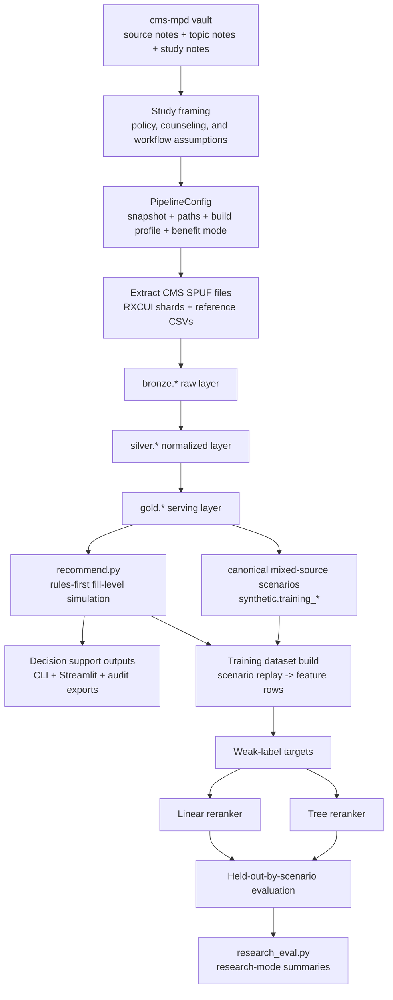

# CMS MPD Recommendation - Research Flow, Data Logic, and Algorithm

> [!note]
> This note is the methods companion to the revised manuscript drafts. It combines the updated `cms-mpd` knowledge base with direct inspection of the local `CMS-MPD-Recommendation` implementation and current training artifacts.

## Why This Note Exists

This study is easy to misdescribe if the workflow is compressed too aggressively. It is not just:

- a generic recommender,
- a claims-analysis study,
- or a UI mockup for Medicare plan comparison.

It is a linked workflow in which:

1. policy and counseling evidence define the task,
2. CMS source files are transformed into a serving model,
3. beneficiary-specific cost is simulated at fill level,
4. plans are ranked with explicit coverage-aware logic,
5. machine learning reranks only within constrained safety buckets, and
6. evaluation is performed on replayed scenarios rather than observed beneficiary outcomes.

## 1. Evidence Base to Implementation Mapping

The `cms-mpd` vault is not background reading added after the system was built. It directly shapes the implementation.

| Evidence theme | What the note set says | What the system does |
| --- | --- | --- |
| Plan-selection evidence | beneficiaries often miss least-cost plans without help | full-coverage and annual-cost logic drive ranking |
| SHIP counseling | real plan comparison is workflow based and explanation dependent | outputs are grouped into counselor-readable explanation categories |
| Communication and readability | accurate Medicare information can still be hard to interpret | explanation-first outputs matter as much as numeric scores |
| Part D redesign and LIS | January 1, 2024 and January 1, 2025 changed liability materially | runtime logic resolves `2024_standard` versus `2025_redesign` |
| Insulin and pricing distortions | beneficiary cost is not captured by premium or generic status alone | simulation is done at the drug-fill-channel level |
| Operations and oversight | sponsor bids, formularies, files, and enrollment rules shape what plans can do | the study is grounded in public CMS file structure and plan operations |

## 2. End-to-End Research Flow

### Operational sequence

1. `PipelineConfig` resolves where inputs live, where outputs are written, which snapshot is active, and which benefit-design mode to use.
2. `extract.py` finds CMS archives and reference files, then extracts archive members to `data/staging/<snapshot>/raw`.
3. `pipeline.py` builds `bronze`, `silver`, `gold`, and ensures `synthetic` exists.
4. `recommend.py` reads the gold serving layer, simulates fill-level cost, and returns ranked plans with explanation groups and fill traces.
5. `scenario_generation.py` materializes canonical mixed-source scenarios in `synthetic.training_scenarios`, `synthetic.training_scenario_medications`, and `synthetic.training_scenario_manifest`.
6. `scripts/generate_beneficiary_profiles.py` remains available for legacy raw-support `synthetic.syn_*` tables.
7. `modeling.py` replays canonical recommendation scenarios into a feature dataset, computes weak labels, fits rerankers, and evaluates them.
8. `research_eval.py` reshapes evaluation outputs for research mode.

## 3. Data Logic and Transformation

### 3.1 Source families

The implementation combines five source families:

1. CMS SPUF plan, formulary, pricing, pharmacy-network, geography, exclusion, indication, and beneficiary-cost files
2. RXCUI property shards for preferred names and synonyms
3. `insulin_ref.csv` for insulin identification
4. `us_zipcode_geo.csv` for ZIP centroids, population, and density
5. `pde.csv` for utilization defaults and scenario support

The last source family is methodologically important. PDE data are used for defaults and research scenarios, not as direct production truth for live beneficiary recommendations.

### 3.2 Canonical keys

The main business keys are:

| Key | Construction or role | Why it matters |
| --- | --- | --- |
| `plan_key` | `CONTRACT_ID + PLAN_ID + SEGMENT_ID` with blank segment normalized to `000` | stable plan grain across files |
| `contract_plan_key` | `CONTRACT_ID + PLAN_ID` | needed when CMS files omit segment |
| `formulary_id` | plan formulary identifier | connects plans to formulary rows |
| `zip_code` | normalized five-digit ZIP | beneficiary and pharmacy geography grain |
| `county_code` | CMS county identifier | links ZIPs to plan service areas |
| `ndc` | normalized 11-digit drug code | price and formulary grain |
| `rxcui` | normalized RxNorm concept id | medication identity and name resolution |
| `days_supply` | normalized to `30`, `60`, or `90` | standardizes pricing and cost rules |

If these keys are wrong, every downstream recommendation is wrong. The core discipline of the pipeline is preserving these grains across transformations.

### 3.3 Bronze layer

`bronze.*` keeps source files close to raw form while attaching lineage fields:

- `source_file`
- `snapshot_quarter`
- `load_ts`

Important behavior:

- ingestion is string-first and permissive to reduce schema breakage from CMS variation;
- pharmacy-network loading is intentionally fault tolerant because split files can contain malformed rows;
- extraction assumes one member file per CMS archive.

### 3.4 Silver layer

`silver.*` is where business interpretation happens.

| Table                                | Main logic                                                                                       | Study role                                                  |
| ------------------------------------ | ------------------------------------------------------------------------------------------------ | ----------------------------------------------------------- |
| `silver.dim_plan`                    | canonicalizes plan identity, premium, deductible, formulary id, plan type, service-area type     | plan identity source of truth                               |
| `silver.dim_zipcode`                 | normalizes ZIP, county, state, lat/lng, density, county code                                     | geography and distance base                                 |
| `silver.bridge_plan_service_area`    | maps county-based MA and region-based PDP service areas into one county bridge                   | plan eligibility logic                                      |
| `silver.dim_drug_reference`          | merges formulary drug rows, insulin mappings, and RXCUI names or synonyms                        | drug search and medication resolution                       |
| `silver.drug_utilization_defaults`   | derives default quantity and annual fill frequency from PDE behavior                             | lets recommendations run without full manual quantity entry |
| `silver.fact_plan_drug_coverage`     | joins formulary membership, pricing, UM flags, exclusions, indication restrictions, insulin flag | main plan x drug x day-supply fact table                    |
| `silver.fact_plan_pharmacy`          | normalizes retail and mail access, fees, floor prices, in-area status, geolocation               | channel simulation and access logic                         |
| `silver.plan_beneficiary_cost_rules` | normalizes standard beneficiary cost-sharing rules                                               | standard cost simulation                                    |
| `silver.plan_insulin_cost_rules`     | normalizes insulin override copays                                                               | insulin-specific branch                                     |

### 3.5 Gold layer

`gold.*` is the runtime-serving model used by recommendation, UI flows, and modeling code.

| Table                                    | Main role                                                                                 |
| ---------------------------------------- | ----------------------------------------------------------------------------------------- |
| `gold.plan_service_area`                 | eligible plans by ZIP                                                                     |
| `gold.plan_channel_summary`              | plan-level retail and mail counts, fees, and floor prices                                 |
| `gold.plan_preferred_pharmacy_locations` | preferred retail points used for nearest-distance estimates                               |
| `gold.plan_formulary_summary`            | formulary breadth, insulin share, PA/ST/QL rates, excluded rate, restrictiveness class    |
| `gold.plan_network_summary`              | maps channel counts into `adequate`, `limited_preferred_retail`, or `no_preferred_retail` |
| `gold.plan_drug_cost_basis`              | runtime-ready plan x drug x day-supply cost basis with joined rules and insulin overrides |
| `gold.plan_summary`                      | compact plan summary with premium, deductible, and service-area breadth                   |
| `gold.drug_input_defaults`               | serving copy of quantity and fills-per-year defaults                                      |
| `gold.recommendation_features`           | compact feature table for modeling                                                        |
|                                          |                                                                                           |

`gold.plan_drug_cost_basis` is the pivotal table for the study. It is where coverage facts, pricing, tier data, standard rules, and insulin override logic become one runtime-ready plan-drug record.

### 3.6 What is raw truth, what is derived, and what is approximate

The repository makes the most sense when three categories are separated.

#### Raw truth

- CMS SPUF plan, formulary, pricing, pharmacy, geography, and cost-rule files
- RXCUI property shards
- insulin reference
- ZIP reference

#### Deterministic derivation

- plan keys and contract-plan keys
- ZIP-to-county mapping
- plan service-area expansion
- formulary summary metrics
- network flags
- plan-drug cost basis
- contract-year-aware benefit-design resolution

#### Approximation

- PDE-based quantity defaults and `fills_per_year`
- ZIP-centroid preferred-pharmacy distance
- negotiated-price proxy
- weak-label target generation
- synthetic beneficiary generation

This separation is the right way to describe the study in a manuscript. It shows why the system is auditable while still being explicit about where approximation enters.

### 3.7 Mathematical view of data transformation

The end-to-end data flow can be written as a composition of transformation operators:

$$
\mathcal{R}
\xrightarrow{\mathcal{B}}
\mathcal{B}(\mathcal{R})
\xrightarrow{\mathcal{S}}
\mathcal{S}(\mathcal{B}(\mathcal{R}))
\xrightarrow{\mathcal{G}}
\mathcal{G}(\mathcal{S}(\mathcal{B}(\mathcal{R})))
\xrightarrow{\mathcal{Q}_b}
\Pi_b,
$$

where:

- $\mathcal{R}$ is the family of raw CMS, RXCUI, and reference inputs;
- $\mathcal{B}$ is bronze ingestion with lineage preservation;
- $\mathcal{S}$ is silver normalization;
- $\mathcal{G}$ is gold serving-layer materialization;
- $\mathcal{Q}_b$ is the beneficiary-specific query and recommendation operator for beneficiary $b$;
- $\Pi_b$ is the ranked plan set returned for that beneficiary.

At the table level, the core transformation from raw plan and drug files into runtime cost records is:

$$
\text{SilverCoverage}
=
\gamma_{plan\_key, ndc, s}
\Big(
\text{DimPlan}
\bowtie_{formulary\_id}
\text{Formulary}
\bowtie_{plan\_key, ndc, s}
\text{Pricing}
\overset{\text{left}}{\bowtie}
\text{Exclusions}
\overset{\text{left}}{\bowtie}
\text{IndicationCoverage}
\overset{\text{left}}{\bowtie}
\text{DrugReference}
\Big),
$$

where $s$ denotes normalized day supply. This single relation is where plan identity, formulary membership, pricing, restrictions, exclusion signals, and drug identity are aligned at a common grain.

The runtime cost basis is then:

$$
\text{GoldCostBasis}
=
\text{SilverCoverage}
\overset{\text{left}}{\bowtie}
\text{BenefitRules}
\overset{\text{left}}{\bowtie}
\text{InsulinRules},
$$

which shows how policy rules become executable data. In other words, the benefit manual and CMS rule files are not only narrative guidance. They become joined rule tensors indexed by plan, tier, day supply, channel, and coverage level.

Eligibility is likewise a transformation:

$$
\text{EligiblePlans}(z)
=
\sigma_{zip\_code = z}
\big(
\text{PlanServiceArea}
\bowtie
\text{PlanSummary}
\bowtie
\text{PlanNetworkSummary}
\big),
$$

where $z$ is the beneficiary ZIP code. The recommendation engine never starts from all plans nationally. It starts from the service-area-constrained set implied by the transformed data.

## 4. Runtime Recommendation Algorithm

### 4.1 Input normalization

The runtime contract includes:

- ZIP code
- age band
- LIS status
- chronic-condition flags
- pharmacy preference
- user role
- decision focus
- medication list

Medication resolution order is:

1. exact NDC
2. exact RXCUI
3. exact preferred name
4. exact synonym
5. prefix match

Approximate matches are preserved as evidence gaps rather than silently treated as exact truth.

### 4.2 Candidate-plan selection

The engine first limits the plan universe to the beneficiary ZIP by querying `gold.plan_service_area`, then joins `gold.plan_summary` and `gold.plan_network_summary`. Recommendation therefore starts from geographically eligible plans, not from all national plans.

### 4.3 Medication defaults and fill expansion

For each medication:

1. day supply is normalized to `30`, `60`, or `90`;
2. tier family is inferred if needed;
3. quantity and fills-per-year defaults are pulled from `gold.drug_input_defaults`.

The fallback annual-fill rule is:

$$
\text{fills per year} = \left\lceil \frac{365}{\text{days supply}} \right\rceil
$$

The system then expands each medication into annual fill events. That matters because deductible use and annual OOP accumulation are path dependent.

If medication $d$ has $n_d$ fills per year, its fill schedule can be written as:

$$
E_d = \left\{ \left(k, \operatorname{round}\left((k-1)\frac{365}{n_d}\right) \right) : k = 1, \dots, n_d \right\}.
$$

### 4.4 Channel-specific cost simulation

For each fill, the engine evaluates feasible channels among:

- `pref_retail`
- `nonpref_retail`
- `pref_mail`
- `nonpref_mail`

The negotiated-price proxy is:

$$
\text{negotiated} = \max(\text{unit cost} \times \text{quantity} + \text{dispensing fee}, \text{floor price})
$$

For plan $p$, drug $d$, fill $k$, and channel $c$, the same quantity can be written more formally as:

$$
g_{pdkc} = \max(u_{pds} q_{dk} + f_{pc\tau s}, \phi_{pc}),
$$

where $u_{pds}$ is unit cost, $q_{dk}$ is fill quantity, $f_{pc\tau s}$ is channel-specific dispensing fee for tier family $\tau$ and day supply $s$, and $\phi_{pc}$ is the channel floor price.

The engine then applies:

1. deductible handling when applicable;
2. standard beneficiary cost-sharing or insulin overrides;
3. LIS adjustments;
4. annual OOP-cap enforcement in the 2025 branch.

The cheapest feasible channel is selected, but a continuity rule keeps the previous channel when near-tied so the simulated fill path does not switch unrealistically across adjacent fills.

The selection rule is:

$$
c^\ast_{pdk} = \arg\min_{c \in \mathcal{C}_{pdb}} o_{pdkc},
$$

where $\mathcal{C}_{pdb}$ is the feasible channel set and $o_{pdkc}$ is final beneficiary OOP. The implementation then applies a near-tie continuity rule with tolerance $\epsilon = 1.00$ dollars before breaking ties by preferred-channel status and pharmacy preference.

### 4.5 Benefit-design branches

The code explicitly resolves benefit design.

- `2024_standard` uses the historical phase structure, including the initial coverage limit and coverage-gap logic.
- `2025_redesign` applies deductible handling, standard or insulin rules, LIS adjustments, and a `$2,000` annual cap.
- `auto` resolves by contract year when available, otherwise by snapshot year.

This contract-year logic is a direct response to the updated policy notes. The repository is not treating 2024 and 2025 as one interchangeable benefit structure.

The 2025 branch is a state update on remaining deductible $D_{k-1}$ and accumulated OOP $O_{k-1}$:

$$
\delta_{pdkc} = \min(g_{pdkc}, D_{k-1}),
$$

$$
c^{base}_{pdkc} =
\begin{cases}
\delta_{pdkc} + \psi(g_{pdkc} - \delta_{pdkc}; \theta^{init}_{pc}), & \text{standard drug} \\
\min(\theta^{ins}_{pc}, g_{pdkc}), & \text{insulin override available,}
\end{cases}
$$

where $\psi(\cdot;\theta)$ is the CMS copay-or-coinsurance rule function implied by the joined beneficiary-cost tables.

LIS adjustment is then:

$$
L(c,\ell,\tau)=
\begin{cases}
\min(c, 4.90), & \ell=\text{full},\ \tau=\text{generic} \\
\min(c, 12.15), & \ell=\text{full},\ \tau=\text{brand} \\
\min(0.75c, 12.00), & \ell=\text{partial},\ \tau=\text{generic} \\
\min(0.75c, 35.00), & \ell=\text{partial},\ \tau=\text{brand} \\
c, & \ell=\text{none},
\end{cases}
$$

and the 2025 annual cap becomes:

$$
o_{pdkc}^{2025} =
\begin{cases}
0, & O_{k-1} \geq 2000 \\
\min(L(c^{base}_{pdkc}, \ell, \tau), 2000 - O_{k-1}), & O_{k-1} < 2000.
\end{cases}
$$

The 2024 branch instead uses historical phase splitting. If total drug spending before fill $k$ is $T_{k-1}$, then:

$$
g^I_{pdkc} = \min(g_{pdkc}, \max(0, 5030 - T_{k-1})),
\qquad
g^G_{pdkc} = g_{pdkc} - g^I_{pdkc},
$$

$$
c^G_{pdkc} = 0.25 \, g^G_{pdkc}.
$$

### 4.6 Explanation generation

The runtime engine groups explanation output into:

- coverage issues
- utilization-management issues
- insulin considerations
- pharmacy-access issues
- deductible issues
- cost-logic issues

This grouping is one of the clearest places where the SHIP and readability literature shapes the implementation.

### 4.7 Baseline ranking logic

The baseline rank is rules-first, but it is not a naive sort on one score. The ordering logic is effectively:

1. fully covered and fully priceable plans first;
2. more priced drugs first;
3. higher fit score;
4. lower annual total cost;
5. fewer uncovered drugs;
6. fewer restrictions;
7. better network status.

`rules_score` is still exported and used as an important signal, but the actual baseline rank is a lexicographic coverage-aware ordering with fit-score support.

The exported rules score is:

$$
R_p =
10000 \, \mathbf{1}\{\text{coverage}_p = \text{full}\}
- T_p
- 250U_p
- 35H_p
- 20N_p,
$$

where $T_p$ is annual total cost, $U_p$ is uncovered-drug count, $H_p$ is restriction count, and $N_p$ is the network-priority penalty.

The baseline ranking can therefore be written as:

$$
\pi_{\text{rules}} =
\operatorname{lexsort}
\left(
\kappa(p),
-n_p^{priced},
-F_p,
T_p,
U_p,
H_p,
N_p,
\text{name}_p
\right),
$$

where $\kappa(p)\in\{0,1,2\}$ is the recommendation bucket and $F_p$ is the fit score.

The fit score is a weighted sum:

$$
F_p = w_c S_p^{cost}
+ w_m S_p^{premium}
+ w_v S_p^{coverage}
+ w_a S_p^{access}
+ w_s S_p^{stability},
$$

with weights determined by decision focus and user role:

$$
w_j =
\frac{\max(0, w_j^{focus} + \Delta_j^{role})}
{\sum_{r}\max(0, w_r^{focus} + \Delta_r^{role})}.
$$

The coverage, access, and stability components are explicit penalty functions:

$$
S_p^{coverage}
=
\operatorname{clip}\left(
100
- 22\mathbf{1}\{\text{coverage}_p \neq \text{full}\}
- 10U_p^{only}
- 18E_p
- 14M_p
- 12C_p,
0,100\right),
$$

$$
S_p^{access}
=
\operatorname{clip}\left(
B_p
- D_p
- 6\Sigma_p
- 6\max(M_p^{mail}-1,0)
- P_p^{pref},
0,100\right),
$$

$$
S_p^{stability}
=
\operatorname{clip}\left(
100
- 9H_p
- 8\Sigma_p
- \Pi_p^{ded}
- 4C_p,
0,100\right),
$$

where $E_p$ is excluded-drug count, $M_p$ is missing-price count, $C_p$ is channel-unavailable count, $\Sigma_p$ is channel-switch count, $B_p$ is the network-base access score, and $\Pi_p^{ded}$ is deductible-pressure penalty.

The implementation then applies a final coverage guardrail:

$$
F_p \leftarrow
\begin{cases}
\max(F_p, 60 + 0.15S_p^{coverage}), & \text{coverage}_p = \text{full} \\
\min(F_p, 59), & \text{otherwise.}
\end{cases}
$$

## 5. Research Evaluation Workflow

To assess whether hybrid reranking improves counselor-facing plan ordering without weakening medication safety, the study uses a replay-based evaluation workflow built on scenario-level recommendation outputs rather than observed beneficiary choices. Let $\mathcal{S}=\{s_1,\dots,s_N\}$ denote a set of beneficiary scenarios, where each scenario $s$ consists of a beneficiary profile and a medication regimen. For each scenario $s$, the rules-based recommendation engine is executed on the full set of ZIP-eligible plans, producing a plan set

$$
\mathcal{P}_s=\{p_1,\dots,p_{M_s}\},
$$

together with simulated annual cost, coverage, access, and utilization-management attributes for each candidate plan.

### 5.1 Scenario construction

The current implementation no longer builds the dataset from an implicit fallback chain. It first materializes a canonical scenario layer in `synthetic.training_*`, then replays the recommendation engine over that layer. The default strategy is mixed-source generation, combining PDE-grounded scenarios, benchmark scenarios, and stress scenarios under the current recommender taxonomy:

- `low_utilizer`
- `maintenance_generic`
- `insulin_chronic`
- `specialty_high_cost`
- `mixed_restriction`
- `access_sensitive`

Under the default full build, the generator targets `600` scenarios total, or `100` per canonical bundle, with a `50 / 30 / 20` mix of PDE-grounded, benchmark, and stress scenarios. ZIP assignment is stratified rather than based on the first available ZIPs, and the manifest records bundle counts, source-kind counts, diversity diagnostics, and intended-profile match rates.

#### Dataset build sequence

The training dataset is constructed by replaying the live recommendation engine over each materialized canonical scenario rather than by reading a pre-labeled table. Let $s \in \mathcal{S}$ denote one beneficiary-regimen scenario and let

$$
\mathcal{P}_s = \mathrm{Recommend}(s)
$$

denote the ranked candidate-plan set returned by the rules engine for that scenario. In the implementation, benchmark scenarios are intentionally created with a large `top_n` so that the replay captures a deep local candidate set rather than only a short user-facing shortlist.

The construction operator can therefore be written as

$$
\mathcal{D}
=
\bigcup_{s \in \mathcal{S}}
\bigcup_{p \in \mathcal{P}_s}
\left\{
\left(
\mathbf{x}_{s,p},
\tilde{y}_{s,p},
\mathrm{rel}_{s,p}
\right)
\right\},
$$

where each tuple is created in four steps:

1. materialize a canonical beneficiary profile and medication list for scenario $s$ in `synthetic.training_*`;
2. execute `recommend_plans(...)` in rules mode on the ZIP-eligible candidate set for $s$;
3. flatten each returned `PlanRecommendation` into one scenario-plan feature row $\mathbf{x}_{s,p}$;
4. compute the weak supervisory score $\tilde{y}_{s,p}$ and scenario-local relevance label $\mathrm{rel}_{s,p}$.

This means the dataset grain is not beneficiary-level and not drug-level. The grain is:

$$
\text{one row} = (\text{scenario } s,\ \text{candidate plan } p).
$$

Methodologically, this choice matters because the reranker is being trained to reorder plans within a beneficiary-specific choice set. It is not being trained to predict an absolute plan-quality label in isolation from the scenario that generated it.

As of April 11, 2026, the replay builder itself is chunked and resumable. Instead of holding all feature rows in memory until the end of the run, the implementation now partitions the scenario set into persisted chunk files under `data/training/<snapshot>/<profile>/hybrid_reranker_dataset.chunks/`. Each chunk replays a bounded scenario subset, writes a chunk CSV plus a chunk metadata file, and updates a build manifest. This change serves two purposes. First, it reduces long-run fragility on Windows multiprocessing workflows by keeping worker lifetimes shorter and recycling chunk tasks rather than relying on one monolithic process pool for the full national scenario set. Second, it turns the dataset build into a restartable pipeline:

$$
\mathcal{D}
=
\bigcup_{c=1}^{C} \mathcal{D}_c,
\qquad
\mathcal{D}_c
=
\bigcup_{s \in \mathcal{S}_c}
\bigcup_{p \in \mathcal{P}_s}
\left\{
\left(
\mathbf{x}_{s,p},
\tilde{y}_{s,p},
\mathrm{rel}_{s,p}
\right)
\right\},
$$

where $\mathcal{S}_c$ is the set of scenarios assigned to chunk $c$. If a long run is interrupted, the builder resumes from the completed chunk manifest rather than discarding already materialized rows.

### 5.2 Feature-row construction

For each scenario-plan pair $(s,p)$, the recommendation output is converted into a feature vector

$$
\mathbf{x}_{s,p}=\phi(s,p),
$$

where $\phi(\cdot)$ summarizes the simulated recommendation result into structured model features. These include:

- cost features such as annual premium, annual drug out-of-pocket cost, annual total cost, deductible exposure, and LIS-adjusted out-of-pocket cost;
- coverage features such as covered share, uncovered-drug count, priced-drug share, exclusion burden, and missing-price burden;
- access and stability features such as network risk score, preferred-pharmacy counts, distance bucket, channel-switch count, mail-order dependency, and insulin nonpreferred-channel dependency;
- scenario-safety descriptors such as `scenario_bundle`, `scenario_profile`, `fallback_group`, `match_review_required_flag`, `unknown_network_data_flag`, and `unsafe_reason_count`.

Operationally, the feature-row constructor merges four information sources into the same row:

1. runtime simulation outputs from `recommend.py`, including annual cost, coverage status, channel choice, and fill-trace summaries;
2. plan-level features from `gold.recommendation_features`, such as formulary burden, pharmacy counts, deductible, and served-county breadth;
3. beneficiary attributes from the scenario definition, such as LIS status, age band, chronic-condition count, and pharmacy preference;
4. ZIP-context features from `silver.dim_zipcode`, particularly density category and its derived numeric score.

Thus, if $\psi(p)$ denotes plan-level serving features, $\beta(s)$ denotes beneficiary descriptors, and $\zeta(s)$ denotes ZIP-context descriptors, then the row-construction map can be summarized as

$$
\mathbf{x}_{s,p}
=
\phi(s,p)
=
g\!\left(
\mathrm{Simulate}(s,p),\,
\psi(p),\,
\beta(s),\,
\zeta(s)
\right).
$$

Thus, the training dataset is neither raw CMS source data nor raw claims data. It is a replay dataset built from simulated recommendation outcomes.

### 5.3 Weak-label target

Because no observed ground-truth label exists for the "best" plan in each scenario, the study defines a weak supervisory target. For each $(s,p)$, a weak-label score $\tilde{y}_{s,p}$ is computed as

$$
\tilde{y}_{s,p}
=
\beta_0 \mathbf{1}\{c_{s,p}=\mathrm{full}\}
+ R_{s,p}
- T_{s,p}
- \lambda_1 U_{s,p}
- \lambda_2 E_{s,p}
- \lambda_3 M_{s,p}
- \lambda_4 C_{s,p}
- \lambda_5 H_{s,p}
- \lambda_6 A_{s,p},
$$

where $c_{s,p}$ is coverage status, $R_{s,p}$ is the original rules score, $T_{s,p}$ is annual total cost, $U_{s,p}$ is uncovered-drug burden, $E_{s,p}$ is exclusion burden, $M_{s,p}$ is missing-price burden, $C_{s,p}$ is channel-unavailable burden, $H_{s,p}$ captures additional friction terms such as utilization-management restrictions and approximate matching, and $A_{s,p}$ captures access and network penalties. In the implementation, full coverage receives a large positive bonus so that medication safety dominates secondary tradeoffs.

A simpler heuristic baseline is also defined:

$$
h_{s,p}
=
\gamma_0 \mathbf{1}\{c_{s,p}=\mathrm{full}\}
+ R_{s,p}
- T_{s,p}
- \eta_1 U_{s,p}
- \eta_2 H_{s,p}
- \eta_3 A_{s,p}.
$$

Plans are then ordered within each scenario by $\tilde{y}_{s,p}$, and a graded relevance label is assigned from the weak-label rank:

$$
\mathrm{rel}_{s,p}=\max(0,\,6-\mathrm{rank}_{\tilde{y}}(s,p)).
$$

This relevance mapping supports rank-based evaluation metrics while preserving within-scenario structure.

### 5.4 Model fitting

The training dataset is

$$
\mathcal{D}=\{(\mathbf{x}_{s,p},\tilde{y}_{s,p},\mathrm{rel}_{s,p}) : s\in\mathcal{S},\, p\in\mathcal{P}_s\}.
$$

Two reranker families are fitted:

- a linear ridge-regression model over encoded numeric and categorical features;
- a small additive tree ensemble that captures non-linear interactions.

Both models are trained to predict $\tilde{y}_{s,p}$ from $\mathbf{x}_{s,p}$. Teacher features such as the live rules rank, rules score, and fit sub-scores are retained in the dataset for audit, but the default training policy excludes them from the model feature set so that the reranker does not directly learn on the teacher outputs it is trying to refine. The saved artifact stores the feature schema, weak-label version, dataset schema version, feature version, teacher-feature policy, and training metadata so that the learned model remains traceable to the exact dataset configuration used at fit time.

### 5.5 Held-out-by-scenario evaluation

Evaluation now reports three held-out modes rather than a single split: by scenario, by beneficiary ZIP, and by regimen signature. The primary report remains scenario-held-out, but ZIP-held-out and regimen-held-out splits are produced alongside it to give a more credible picture of generalization under geographic and regimen novelty. Formally, for each split mode the scenario-derived row set is partitioned into disjoint training and test subsets,

$$
\mathcal{S}=\mathcal{S}_{\mathrm{train}} \cup \mathcal{S}_{\mathrm{test}},
\qquad
\mathcal{S}_{\mathrm{train}} \cap \mathcal{S}_{\mathrm{test}}=\varnothing,
$$

so that all plan rows belonging to a given beneficiary scenario appear in only one split. This reduces leakage and better measures generalization to unseen counseling cases. The current implementation uses seed `42` and test fraction `0.3`.

For each held-out scenario $s \in \mathcal{S}_{\mathrm{test}}$, the study compares:

- `rules_only`
- `heuristic_baseline`
- `linear_reranker`
- `tree_reranker`
- feature-ablation variants

Let $\pi_s^{(m)}$ denote the ranking induced by method $m$, and let $\pi_s^\star$ denote the weak-label reference ranking. Performance is summarized by top-$k$ overlap,

$$
\mathrm{Overlap}_k(\pi_s^{(m)},\pi_s^\star)
=
\frac{\left|\mathrm{Top}_k(\pi_s^{(m)})\cap \mathrm{Top}_k(\pi_s^\star)\right|}{\min(k, |\pi_s^\star|)},
$$

and normalized discounted cumulative gain,

$$
\mathrm{NDCG}@k
=
\frac{\mathrm{DCG}@k}{\mathrm{IDCG}@k},
\qquad
\mathrm{DCG}@k
=
\sum_{i=1}^{k}
\frac{2^{\mathrm{rel}_{s,\pi_i^{(m)}}}-1}{\log_2(i+1)}.
$$

The evaluation also reports operational safety metrics, including:

- top-1, top-5, and top-10 full-coverage rates;
- average total cost in the top-ranked plans;
- average uncovered-drug burden in the top-ranked plans;
- blocker-classification precision;
- match-review trigger rate;
- plans dropped due to missing data;
- the proportion of scenarios that include plans labeled with unknown network status.

### 5.6 Hybrid safety constraint

The learned model is not allowed to reorder plans across safety buckets. If $\hat{y}_{s,p}$ is the model-predicted weak-label score and $\mathcal{B}_0$, $\mathcal{B}_1$, and $\mathcal{B}_2$ denote the fully priceable, partially priceable, and fallback buckets, the deployed hybrid ranking is

$$
\pi_{\mathrm{hybrid}}
=
\bigcup_{b \in \{0,1,2\}}
\operatorname{sort}_{p \in \mathcal{B}_b}
\left(
-\hat{y}_{s,p},
-n_{s,p}^{\mathrm{priced}},
-R_{s,p},
T_{s,p},
U_{s,p},
H_{s,p},
\mathrm{name}_p
\right).
$$

Thus, machine learning acts as a constrained reranker rather than a replacement for the rules engine. The research question is whether reranking improves ordering within admissible safety sets, not whether it can override the primary coverage logic.

## 6. Current Artifact State and Reproducibility

The local rebuilt artifact state is now synchronized with the current code path:

- dataset schema version: `request_features_v4`
- weak-label version: `weak_label_v2`
- feature version: `research_v4`
- dataset rows: `16116`
- scenario count: `300`
- scenario source: `default`
- scenario bundles:
  - `low_generic`
  - `maintenance_brand`
  - `insulin_only`
  - `insulin_plus_chronic`
  - `specialty_high_cost`
  - `rural_access_sensitive`

The refreshed evaluation report currently indicates:

- `top5_improved = true`
- `top10_improved = true`
- `uncovered_not_worse = true`

One interpretation note remains important. The current report may show

$$
\mathrm{pct\_runs\_with\_unknown\_network\_data}=1.0,
$$

but this no longer indicates missing network-summary rows in the rebuilt database. It now means that at least one evaluated candidate plan in many scenarios is legitimately assigned `network_flag = 'unknown'` as a modeled access state.

## 7. How To Describe This Study In Manuscripts

The strongest description is:

- a counselor-oriented Medicare Part D decision-support system;
- a policy-aware and auditable cost-simulation pipeline;
- an explanation-first ranking workflow;
- a research platform for constrained reranking.

The weakest description is:

- a novel generic recommender;
- a validated beneficiary-outcome predictor;
- a claims-adjudication-equivalent pricing engine.

The central methodological decision is the order of operations:

1. transform CMS sources into a serving model;
2. simulate cost and coverage first;
3. explain tradeoffs in counselor-readable categories;
4. rank with explicit coverage-aware rules;
5. allow machine learning only to rerank within constrained safety buckets.

That order is what makes the study coherent with the updated `cms-mpd` evidence base.

## 8. Related Notes

- [[CMS MPD Recommendation - Journal Manuscript Draft]]
- [[CMS MPD Recommendation - Research Manuscript Draft]]
- [[Source - Plan Selection and Decision Support Evidence]]
- [[Source - SHIP Counseling and Beneficiary Navigation]]
- [[Source - Part D Reform and IRA Timeline]]
- [[Source - Extra Help and LIS Operations]]
- [[Source - Insulin Affordability in Part D]]
- [[Source - Drug Pricing and Formulary Distortions]]
- [[Source - Part D Operations, Enrollment, and Bidding Guidance]]
- [[Source - MedPAC Part D Status Reports and Oversight]]
- [[Source - Medicare Communication and Beneficiary Readability]]

## Implementation Sync - 2026-04-08

This note now needs to reflect the counselor-first compare workflow that was implemented in the local `CMS-MPD-Recommendation` codebase on April 8, 2026.

### What Changed In The Implementation

- The code now exposes a grouped decision-support contract, `recommend_plan_bundle(...)`, in addition to the earlier flat `recommend_plans(...)` output.
- The grouped contract returns:
  - `summary`
  - `full_coverage_plans`
  - `partial_fallback_plans`
  - `comparison_only_plans`
  - `blocked_medications`
  - `alternative_search_terms`
- Full coverage is now interpreted strictly at regimen level: every entered medication must be both `covered` and `priced` inside the same local ZIP-eligible plan.
- The system evaluates all local candidate plans first, then partitions them into full-coverage and partial-fallback sets before any `top_n` truncation is applied.
- If at least one local full-coverage plan exists, the primary shortlist contains only those plans.
- If no local full-coverage plan exists, the primary shortlist is intentionally empty and the system renders a separate local fallback section instead of mixing partial plans into the main shortlist.

### Compare-Mode Sorting Logic

The implemented counselor compare mode uses deterministic cost-first ordering rather than the earlier flat ranking order.

For local full-coverage plans the compare-mode shortlist is sorted by:

1. annual total cost;
2. annual drug out-of-pocket cost;
3. restriction count;
4. network quality and preferred-pharmacy distance;
5. channel-switch count;
6. fit score;
7. plan name.

For local fallback plans, when no local full-coverage plan exists, the compare-mode shortlist is sorted by:

1. requested-drug coverage percent;
2. priced-drug count;
3. annual total cost;
4. restriction count;
5. network quality and preferred-pharmacy distance;
6. fit score;
7. plan name.

### Blocked Exact Drugs And Alternative Search

The new blocker logic explicitly distinguishes between two operational cases:

- `never_local_coverable`: no local ZIP-eligible plan covers and prices the exact entered product.
- `not_jointly_coverable`: the drug is locally coverable somewhere, but no single local plan covers the whole entered regimen together.

Alternative search seeds are now derived conservatively from the resolved drug name by removing bracketed brand text and truncating before the first numeric token. The result is used only to pre-populate catalog search suggestions. The system does not auto-substitute drugs and does not rerun recommendations until a counselor explicitly chooses an alternate product.

### Streamlit And CLI Sync

The Streamlit counselor workflow now renders four separate result sections:

1. Local full-coverage plans.
2. Best local fallback plans.
3. Nearby comparison-only plans.
4. Blocked exact drugs and alternative search.

The CLI also now supports `--shortlist-mode full_coverage_compare`, while the default flat JSON array is preserved for backward compatibility.

### Practical Implication For Vault-Based Case Review

Vault case notes should now record the following explicitly:

- whether the primary shortlist contained any local full-coverage plans;
- whether blocked exact drugs were `never_local_coverable` or only `not_jointly_coverable`;
- whether nearby out-of-area plans were shown only as comparison-only context;
- whether any medication rerun depended on an explicit alternate-product choice.

### Validation On The Current Local Dataset

Using the current DuckDB build and ZIP `43004`:

- Exact `Semglee` case:
  - `insulin glargine-yfgn 100 UNT/ML Injectable Solution [Semglee]`
  - `rxcui=2563977`
  - `ndc=83257001111`
  - plus `rosuvastatin calcium 10 MG Oral Tablet`
  - returned `0` local full-coverage plans and flagged the insulin product as `never_local_coverable`.
- Alternate glargine case:
  - `insulin glargine-yfgn 100 UNT/ML Injectable Solution`
  - `rxcui=2563976`
  - `ndc=83257001411`
  - plus `rosuvastatin calcium 10 MG Oral Tablet`
  - returned `6` local full-coverage plans, with the top shortlist beginning with Wellcare plans.

## Implementation Sync - 2026-04-09

This note now also reflects the scenario-precise recommendation pass implemented on April 9, 2026.

### What Was Added

- Candidate-plan selection now keeps ZIP-eligible plans even when pharmacy-network summary rows are missing, and marks those plans as `unknown` rather than dropping them from runtime comparison.
- Drug resolution now follows a reviewed-candidate workflow:
  - `resolve_drug_candidates(...)` produces scored candidates;
  - exact NDC and exact RXCUI remain authoritative;
  - ambiguous name-only input now stops final ranking and requires manual review instead of silently choosing a loose match.
- Each recommendation now carries:
  - `scenario_profile`
  - `match_review_required`
  - `unsafe_reasons`
- The scenario profile is assigned deterministically before final compare ordering and currently includes:
  - `low_utilizer`
  - `maintenance_generic`
  - `insulin_chronic`
  - `specialty_high_cost`
  - `mixed_restriction`
  - `access_sensitive`

### Scenario-Aware Interpretation

The implemented compare flow is no longer only cost-first in a generic sense. It now treats plan comparison as a safety-gated counseling workflow:

1. ZIP-eligible local plans are enumerated.
2. Medication identity is resolved with reviewed candidates.
3. Exact-regimen full coverage is checked.
4. Network and access uncertainty are surfaced as explicit warnings rather than silent exclusions.
5. Scenario-specific tie-breaking is applied only inside the safe comparison set.

In practical terms, this means:

- specialty and high-cost regimens are ordered with more weight on utilization-management burden and continuity;
- insulin regimens emphasize insulin channel stability and drug out-of-pocket exposure;
- access-sensitive cases emphasize network confidence and distance before secondary cost tradeoffs.

### Alternative Product Workflow

Blocked-drug alternatives now behave more conservatively and more precisely:

- search seeds are derived from resolved product names after removing bracketed brand text, strength tokens, and dose-form suffixes;
- alternative product suggestions are ranked by insulin consistency, route consistency, RXCUI closeness, local plan coverage, and day-supply compatibility;
- the counselor must explicitly apply the selected alternative before rerunning recommendation logic.

### Data And Evaluation Sync

The modeling workflow now reflects the same implementation assumptions:

- canonical scenario generation now materializes `synthetic.training_scenarios`, `synthetic.training_scenario_medications`, and `synthetic.training_scenario_manifest` before dataset replay;
- the canonical bundle taxonomy now matches the live recommender scenario profiles:
  - `low_utilizer`
  - `maintenance_generic`
  - `insulin_chronic`
  - `specialty_high_cost`
  - `mixed_restriction`
  - `access_sensitive`
- the default generation strategy is now `mixed`, combining PDE-grounded, benchmark, and stress scenarios under the canonical bundle taxonomy;
- feature rows now capture scenario profile, match-review flags, unknown-network flags, unsafe-reason counts, and candidate-plan counts;
- teacher features remain in the dataset for audit, but the default training policy is now `student_safe`, which excludes direct teacher outputs from the model feature set;
- evaluation summaries now report scenario-sensitive outcomes such as full-coverage rates, blocker-classification precision proxy, match-review trigger rate, and runs affected by unknown network data.

### Rebuilt Artifact And Replay State

The local DuckDB artifact, canonical scenario layer, training dataset, and reranker artifacts were rebuilt on April 11, 2026 from the staged `2025-Q3` raw files under `data/staging/`.

#### Database rebuild status

The rebuilt `data/cms_mpd.duckdb` now matches the current pipeline assumptions:

- `health_check()` now returns `ok = true`;
- `gold.plan_summary`, `gold.plan_network_summary`, `gold.plan_channel_summary`, and `gold.recommendation_features` each cover `5631` distinct plans;
- plans missing `gold.plan_network_summary` rows dropped from `531` to `0`;
- `gold.recommendation_features` now has `0` rows with null `network_flag`;
- ZIP runtime candidate completeness is now exact, with `0` mismatched ZIP codes;
- `silver.fact_plan_pharmacy` is now materialized as a base table rather than a view.

The remaining `gold.plan_formulary_summary` versus `gold.plan_summary` delta of `40` plans is still reported for visibility, but it is not treated as a missing-data failure in the current health-check contract.

#### Training dataset sync

The training dataset was rebuilt after the database refresh and replay-optimization pass and is now aligned with the current code:

- dataset schema: `request_features_v4`
- feature version: `research_v4`
- weak-label version: `weak_label_v2`
- row count: `33961`
- scenario count: `600`
- scenario source: `mixed`
- teacher-feature policy: `student_safe`
- chunk manifest version: `dataset_chunks_v2`
- chunk count: `88`
- chunk size: `10`
- ZIP-grouped chunks: `true`

The rebuilt canonical bundles are:

- `low_utilizer`
- `maintenance_generic`
- `insulin_chronic`
- `specialty_high_cost`
- `mixed_restriction`
- `access_sensitive`

This means `data/training/2025-Q3/full/` is no longer carrying the earlier benchmark-only fallback path. The dataset is now built from canonical mixed-source scenarios and stored through a resumable chunk manifest.

#### Replay optimization status

The replay builder now preserves exact dataset semantics while avoiding repeated DuckDB work across similar scenarios:

- chunks are planned by ZIP before replay, so scenarios sharing a ZIP reuse prefetched candidate-plan, channel-summary, and nearest-distance context;
- each worker now builds read-only caches for canonical drug references, drug-input defaults, dominant tier lookups, ZIP candidate plans, ZIP channel summaries, and ZIP-plus-drug cost-basis rows;
- chunk output is persisted under `data/training/2025-Q3/full/hybrid_reranker_dataset.chunks/` as one CSV plus one metadata JSON per chunk, with a manifest that tracks `pending`, `started`, `completed`, and `failed` status;
- stale `started` chunks are cleaned up by default after `6` hours;
- Windows worker recycling now uses one chunk per child process (`max_tasks_per_child = 1`) to reduce long-lived worker stalls.

Measured local build behavior on April 11, 2026:

- full `600`-scenario mixed build with `4` workers and `10`-scenario chunks completed in about `632` seconds;
- the earlier pre-optimization full build had taken about `5462` seconds;
- rerunning the same command after completion reused all `88` chunks and rewrote the final dataset in about `8.45` seconds.

#### Model artifact sync

Both reranker artifacts were retrained against the rebuilt dataset:

- `data/models/2025-Q3/full/hybrid_reranker_linear.json`
- `data/models/2025-Q3/full/hybrid_reranker_tree.json`

Both artifacts now report:

- dataset schema: `request_features_v4`
- feature version: `research_v4`
- training rows: `33961`
- scenario count: `600`
- teacher-feature policy: `student_safe`

The evaluation report in `data/training/2025-Q3/full/hybrid_reranker_evaluation_tree.json` was also refreshed from the rebuilt dataset and new artifacts.

#### Evaluation interpretation note

The refreshed evaluation report shows:

- `top5_improved = true`
- `top10_improved = true`
- `uncovered_not_worse = false`

For the current harder mixed-source dataset, the tree reranker improves ranking alignment but no longer satisfies the original no-worse uncovered-drug acceptance check:

- tree reranker top-1 agreement: `0.8611`
- tree reranker top-5 overlap: `0.9344`
- tree reranker top-10 overlap: `0.9622`
- tree reranker top-5 average uncovered drugs: `0.4589`
- rules-only top-5 average uncovered drugs: `0.4144`

One metric still needs careful interpretation:

- `pct_runs_with_unknown_network_data = 1.0`

In the rebuilt state, this no longer means network-summary rows are missing. It now means at least one plan in many evaluated scenarios is legitimately labeled with `network_flag = 'unknown'` as a modeled access state, not that the underlying plan was dropped or left null by the pipeline.

The practical implication is that the replay and artifact pipeline is now synchronized and much faster, but the reranker itself still needs another tuning pass on the harder mixed-source dataset if we want the final acceptance criteria to hold again.
