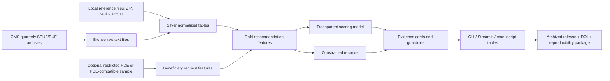

# Deep research report on CMS-MPD-Recommendation and the draft manuscript

## Executive summary

The public entity["company","GitHub","code hosting platform"] repository for **CMS-MPD-Recommendation** is already organized like a serious applied-informatics project rather than a one-off notebook: it exposes a Python package (`src/cms_mpd`), scripts, tests, a Streamlit app, and documentation for architecture, data flow, and modeling. The public tree also shows a single visible commit, no visible releases, and no visible archival/research packaging artifacts such as a DOI, `LICENSE`, `CITATION.cff`, `pyproject.toml`, environment lockfile, or container image specification. That combination means the project is conceptually strong but not yet submission-grade for reproducibility or software citation. citeturn1view0turn2view0turn4view0turn4view1turn4view2turn7view0

The uploaded manuscript is farther along than the repo in publication readiness: it already has an abstract, introduction, methods, experiments, discussion, limitations, reproducibility section, declarations, and a proposed figure list. But it still contains explicit TODOs for authorship, affiliations, corresponding author details, funding, acknowledgements, release/DOI information, and ethics language; it also refers to proposed figures rather than delivered figure assets. Most importantly, the manuscript still reads partly like a promising systems paper and partly like a proposal. To meet journal standards, it needs a tighter data-provenance section, a fully specified reproducible pipeline, an explicit statement about what is public versus restricted in Medicare Part D data, and a clearer limitation framework around “PDE-compatible” rather than true CMS PDE access. fileciteturn0file0L20-L54 fileciteturn0file0L101-L147 fileciteturn0file0L209-L252 fileciteturn0file0L305-L395

The most important technical and editorial gap is **data provenance**. Public quarterly formulary/network/pricing data from the entity["organization","Centers for Medicare & Medicaid Services","federal health agency"] are openly available through the Medicare Part D formulary, pharmacy network, and pricing public-use release, but full Prescription Drug Event data are not public and must be requested under CMS’s restricted Part D data process. Your repo documentation already differentiates “PDE-compatible” sample input from official public files, but the manuscript should say this even more plainly, because readers and reviewers will immediately ask whether the study uses true PDE claims or a local synthetic/compatible surrogate. citeturn13search0turn19search0turn19search10turn19search5

There is also a concrete version-control inconsistency that should be fixed before submission. The manuscript describes a schema/versioning layer around `request_features_v4` and `weak_label_v2`, while the public modeling module exposes `DATASET_SCHEMA_VERSION = "request_features_v2"` and `WEAK_LABEL_VERSION = "weak_label_v2"`. That is exactly the kind of mismatch a reviewer will flag as evidence that the paper and code were not locked to the same release. fileciteturn0file0L213-L221 citeturn10view5

From the literature side, the source base is rich and highly usable for a journal revision. CMS documents are the anchor for workflow, file structure, PDE reporting, bidding, network access, and IRA redesign. The best secondary policy sources are entity["organization","KFF","health policy nonprofit"], entity["organization","Medicare Payment Advisory Commission","medicare advisory body"], entity["organization","Government Accountability Office","federal audit agency"], entity["organization","HHS Office of Inspector General","federal oversight office"], and the entity["organization","Congressional Budget Office","federal budget agency"]. The peer-reviewed literature is now mature enough to support claims about post-IRA plan redesign, utilization restrictions, rebates/PBMs, preferred pharmacy networks, GLP-1s, insulin, biosimilars, dual-eligible access, and negotiation-era formulary behavior. citeturn14search4turn14search1turn14search6turn14search3turn25search0turn15search0turn15search1turn15search2turn16search2turn18search0

## Repo and manuscript audit

The visible public repo has a coherent architecture. The root listing shows `README.md`, `requirements.txt`, `pytest.ini`, `streamlit_app.py`, plus `docs/`, `scripts/`, `src/`, and `tests/`. The README presents a medallion-style ETL design, explainability-first recommendation logic, and a planned data directory that includes raw CMS extracts, local reference tables, and a `pde.csv` input under `references_data/`. The documentation expands that into bronze/silver/gold layers, canonical plan and beneficiary keys, and chat, recommendation, and PDE-compatible evaluation flows. citeturn1view0turn2view0turn5view0turn5view1turn5view2turn6view3turn6view4turn6view5

What is already solid for a software-methods paper is the project’s separation of concerns. The `src/cms_mpd` package is broken into extraction, transforms, modeling, recommendation, chat, evaluation, and pipeline modules; the `scripts/` directory provides ingestion and build entry points; and the `tests/` directory includes smoke tests and schema/evaluation checks. That is a much stronger starting point than a notebook-driven submission. The manuscript’s present structure also matches that maturity: it already frames the work as a policy-aware, explainable recommendation pipeline and includes result tables for ranking quality, budget/clinical trade-offs, and fairness-style guardrails. citeturn4view0turn4view1turn4view2turn2view0 fileciteturn0file0L20-L54 fileciteturn0file0L260-L303

The public reproducibility surface is still too thin for an entity["company","Elsevier","academic publisher"] software journal submission. The visible repo has no public release tag, no archived software DOI, no visible license file, no visible package metadata, and no visible notebook or workflow artifact that regenerates manuscript tables/figures end to end. The requirements file is also very small, listing only `duckdb`, `numpy`, `pandas`, `streamlit`, and `pytest`; if the training or reranking pipeline depends on anything beyond those, the environment specification is incomplete. Even if the package truly only needs those libraries, you still need a pinned environment, a release tag, and a frozen artifact manifest for publication. citeturn1view0turn2view0turn7view0turn24view1

The manuscript has several strengths that should be preserved in the rewrite. It already defines the practical problem, states why Medicare Part D decisions are multi-objective, identifies public data families and private/compatible data constraints, describes a medallion pipeline, reports ranking metrics, and explicitly discusses limitations around weak labels, policy fragility, and the need for future PDE access. Those are excellent ingredients for a methods paper if they are tightened and synchronized with the repo. fileciteturn0file0L55-L104 fileciteturn0file0L148-L252 fileciteturn0file0L330-L347

The highest-priority missing manuscript elements are these:

- **Metadata and front matter are incomplete.** The title page block still contains TODOs for author names, affiliations, and corresponding author details. That is a direct submission blocker. fileciteturn0file0L8-L18
- **The reproducibility section is not yet archival.** It explicitly says the GitHub URL, release tag, and DOI should be inserted later, which means the manuscript and the public code are not yet locked to a citable version. fileciteturn0file0L349-L361
- **The ethics/declarations block is incomplete.** Funding, competing interests, acknowledgements, and author-contribution language still contain placeholders. fileciteturn0file0L362-L381
- **Figure assets are still proposed rather than delivered.** The draft lists suggested figures and appendices but does not yet function as a fully assembled article package with final figure files and captions. fileciteturn0file0L383-L395
- **There is a code-manuscript schema mismatch.** As noted above, the manuscript references `request_features_v4`, while the public code advertises `request_features_v2`. fileciteturn0file0L213-L221 citeturn10view5
- **The distinction between public SPUF/PUF files and restricted PDE data is still too soft.** Reviewers will want a blunt statement that the repo’s public pipeline is driven by quarter-based CMS public files and that any PDE-like file used in experiments is sample, synthetic, or restricted-access compatible unless a CMS DUA is in place. citeturn13search0turn19search0turn19search10

Against the current guide for entity["company","Elsevier","academic publisher"]’s **Computer Methods and Programs in Biomedicine Update**, your manuscript is directionally aligned with the journal’s aims and scope because it is an applied computational workflow and software systems paper in a high-impact policy domain. But journal compliance still requires an abstract of at most 250 words, 1–7 keywords, a complete title page, editable source files, separate figure files and captions, a competing-interest document, an ethics statement or rationale for exemption, and a data statement. The guide also encourages highlights, data linking, and deposit of related data/methods objects. citeturn21view0turn22view0turn22view1turn22view2turn22view4turn23view2turn24view0turn24view1

## Literature review and prioritized sources

The source strategy for this paper should be layered. First, anchor all workflow and data claims in CMS operational and data-specification documents: the quarterly formulary/network/pricing public-use release, methodology documentation, Part D application, bid instructions, Part D benefit manual, PDE guidance, DDPS updates, reporting requirements, and IRA redesign instructions. Second, anchor market and policy interpretation in KFF, MedPAC, GAO, OIG, CBO, and ASPE. Third, use peer-reviewed articles to substantiate claims about plan design, restrictions, preferred networks, rebates, GLP-1s, biosimilars, insulin, negotiation-era coverage, and PBM behavior. That hierarchy keeps the paper methodologically grounded and reduces the risk of over-relying on derivative commentary. citeturn13search0turn13search2turn19search16turn19search0turn19search6turn19search19turn14search4turn14search1turn14search6turn14search3turn25search0

A few literature findings should shape the manuscript narrative. CMS public-use formulary/network/pricing data are public and workflow-relevant, but full PDEs are restricted. Part D redesign under the IRA materially changed benefit structure and sponsor liability, and downstream studies are already showing plan-design responses in 2025. MedPAC and KFF document rapid market changes in enrollment, benefits, and bids; GAO and MedPAC document that rebates are large and can distort incentives; OIG documents continuing dual-eligible access monitoring and improving but incomplete Humira biosimilar coverage; recent JAMA and Health Affairs papers show growing utilization restrictions, higher cost-sharing for some branded and GLP-1 drugs, nontrivial effects of preferred pharmacy networks, and PBM-linked overpayment concerns. Those findings make your central premise timely and defensible, but they also mean your discussion section must explicitly situate the recommender inside an evolving post-IRA market rather than treating plan design as static. citeturn17search5turn15search0turn15search16turn14search1turn14search29turn14search4turn14search0turn14search6turn18search22turn14search3turn16search1turn15search3turn16search2turn15search1turn18search0

### Annotated priority list

**Highest-priority CMS and official data documents**

- **Quarterly Prescription Drug Plan Formulary, Pharmacy Network, and Pricing Information** (CMS data landing page; **Priority: Essential**). This is the primary public source for the repo’s observable plan/formulary/network/pricing workflow, including quarterly snapshots used by Medicare Plan Finder. Use it to ground every statement about public data ingestion. citeturn13search0
- **CY 2026 Part D Formulary, Pharmacy Network, and Pricing Data Methodology** (**Priority: Essential**). This explains file structure, quarterly extraction logic, and the relationship between the public files and Plan Finder. It is the best methodology citation for the public data pipeline. citeturn13search1
- **Prescription Drug Event Data Guidance** (**Priority: Essential**). This is the authoritative source for what a PDE is and why CMS collects it. Use it to distinguish your public pipeline from restricted claims-based extensions. citeturn19search0turn19search20
- **Part D Claims Data / Guide to Requesting Medicare Part D Data** (**Priority: Essential**). This is the documentation you need for the sentence “full PDE data are restricted and require CMS approval/DUA.” citeturn19search10turn19search5turn19search7
- **2026 PDE Examples** (**Priority: Essential**). This is the best operational reference for PDE field logic in the IRA redesign era and should inform any future restricted-data extension or surrogate field dictionary. citeturn19search1
- **Final CY 2026 Part D Redesign Program Instructions** (**Priority: Essential**). Use this to anchor all claims about post-IRA benefit structure, accumulator logic, and redesign-era sponsor liability. citeturn19search4turn19search19
- **CY 2026 Part D Reporting Requirements and Technical Specifications** (**Priority: High**). These clarify operational reporting expectations and are useful for the workflow figure and methods appendix. citeturn19search3turn19search6turn19search9
- **2026/2027 Part D Application and Bid Forms & Instructions** (**Priority: High**). These are the best sources for plan workflow, pharmacy access standards, and sponsor-side operational constraints. citeturn13search20turn19search22turn19search26

**High-priority policy, oversight, and budget sources**

- **KFF: A Current Snapshot of the Medicare Part D Prescription Drug Benefit** (2025; **Priority: Essential**). Best concise overview of enrollment, plan availability, premiums, benefit structure, and IRA-era changes. citeturn14search4turn17search9
- **MedPAC: The Medicare Prescription Drug Program Status Report** (2025, 2026; **Priority: Essential**). Best independent synthesis of spending, financing, bids, and market structure. citeturn15search13turn14search1turn14search9turn14search29
- **GAO: CMS Should Monitor Effects of Rebates on Plan Formularies and Beneficiary Spending** (2023; **Priority: Essential**). Best federal source for rebate-related formulary and beneficiary-spending concerns. citeturn14search6turn14search26
- **GAO: Use of Pharmacy Benefit Managers and Related Rebates/Price Concessions** (2019; **Priority: High**). Best structural federal source on PBM use and rebate pass-through in Part D. citeturn18search1
- **OIG: Part D Plans Generally Include Drugs Commonly Used by Dual-Eligible Enrollees** (2025) and **Trends in Dual-Eligible Enrollees’ Access** (2011–2025; 2025) (**Priority: Essential**). Use these to justify any dual-eligible subgroup framing. citeturn14search3turn14search7
- **OIG: Most Medicare Part D Plans’ Formularies Included Humira Biosimilars for 2025** (**Priority: High**). Strong official biosimilars source tied directly to Part D formularies. citeturn16search1
- **CBO: Paying for Drugs in Medicare Part D Under Current Law and Under Proposals to Redesign the Program** (2021; **Priority: High**). Excellent source for benefit-phase mechanics and redesign intuition. citeturn25search0
- **CBO / ASPE IRA documents** (2022–2025; **Priority: High**). Use these for budgetary and beneficiary impact of the $2,000 cap, LIS changes, inflation rebates, and redesign mechanics. citeturn25search4turn25search16turn25search3turn25search11turn25search7

**High-priority peer-reviewed empirical studies**

- **Cai et al., Changes in Medicare Part D Plan Designs After the Inflation Reduction Act** (JAMA Internal Medicine, 2025; **Priority: Essential**). This is the most directly relevant post-IRA plan-design paper and should be cited in the introduction, results context, and discussion. citeturn15search0turn15search4
- **Health Affairs: Inflation Reduction Act Changes to Part D Plan Design** (2026; **Priority: High**). Useful as a policy-facing complement to Cai et al. and for sponsor-response interpretation. citeturn15search16
- **Joyce et al., Medicare Part D Plans Greatly Increased Utilization Restrictions on Drug Coverage** (Health Affairs, 2024; **Priority: Essential**). Core citation for why a recommender must look beyond premium and deductible alone. citeturn15search3turn15search15
- **Patterson et al., Medicare Part D Coverage of Drugs Selected for the Drug Price Negotiation Program** (JAMA Health Forum, 2024; **Priority: Essential**). Best early evidence on negotiation-era formulary behavior. citeturn15search2turn15search10
- **Klebanoff et al., Medicare Part D Coverage and Costs for GLP-1 Receptor Agonists** (JAMA, 2025; **Priority: Essential**). Best source on GLP-1 coverage, prior authorization, and OOP changes through 2025. citeturn16search2turn16search22
- **Health Affairs: Medicare Part D Preferred Pharmacy Networks and the Risk of Pharmacy Closure** (2025; **Priority: Essential**). Best recent source for pharmacy-network externalities. citeturn15search1
- **Hernandez et al., Overpayment for Generic Drugs Under Medicare Part D** (JAMA Health Forum, 2025; **Priority: High**). Strong PBM/generic-pricing paper for the discussion and limitations section. citeturn18search0turn18search12
- **Trish et al., Cost Sharing for Preferred Branded Drugs in Medicare Part D** (2025; **Priority: High**). Good evidence for tiering and cost-sharing drift. citeturn17search3turn15search35
- **Dusetzina et al., Sending the Wrong Price Signal** (Health Affairs, 2019; **Priority: High**). Important historical paper showing why beneficiary OOP costs can be misaligned with net prices. citeturn18search3turn18search15
- **Kakani et al., Use of and Steering to Pharmacies Owned by Insurers and PBMs** (JAMA Health Forum, 2025; **Priority: Moderate**). Useful if you want a stronger PBM/pharmacy vertical-integration discussion. citeturn18search28

### CSV-style prioritized sources

```csv
priority,year,type,title,url,why_cite
essential,2026,CMS dataset landing page,"Quarterly Prescription Drug Plan Formulary, Pharmacy Network, and Pricing Information","https://data.cms.gov/provider-summary-by-type-of-service/medicare-part-d-prescribers/quarterly-prescription-drug-plan-formulary-pharmacy-network-and-pricing-information","Primary public source for formulary/network/pricing workflow"
essential,2026,CMS methodology,"CY 2026 Medicare Part D Formulary, Pharmacy Network, and Pricing Data: Data Methodology","https://www.cms.gov/files/document/cy-2026-medicare-part-d-formulary-pharmacy-network-and-pricing-data-methodology.pdf","Explains file structure and quarterly extraction logic"
essential,2024,CMS guidance,"Prescription Drug Event Data Guidance","https://www.cms.gov/medicare/prescription-drug-coverage/drugcoverageclaimsdata/index","Authoritative PDE workflow reference"
essential,2024,CMS claims data page,"Part D Claims Data","https://www.cms.gov/medicare/coverage/prescription-drug-coverage/part-d-claims-data","Best citation that full PDE access is restricted"
essential,2025,CMS memo,"2026 PDE Examples","https://www.cms.gov/files/document/prescriptiondrugeventrecordreportinginstructionsg.pdf","Field-level PDE examples in redesign era"
essential,2025,CMS redesign,"Final CY 2026 Part D Redesign Program Instructions","https://www.cms.gov/files/document/final-cy-2026-part-d-redesign-program-instruction.pdf","Benefit redesign and accumulator logic"
high,2025,CMS reporting,"CY 2026 Part D Reporting Requirements","https://www.cms.gov/files/document/cy2026-part-d-reporting-requirements-12-01-2025.pdf","Operational reporting workflow"
high,2025,CMS application,"2027 Part D Application Final","https://www.cms.gov/files/document/2027-part-d-application-final.pdf","Plan application and pharmacy access requirements"
essential,2025,KFF brief,"A Current Snapshot of the Medicare Part D Prescription Drug Benefit","https://www.kff.org/medicare/a-current-snapshot-of-the-medicare-part-d-prescription-drug-benefit/","Best policy overview"
essential,2026,MedPAC report,"The Medicare Prescription Drug Program (Part D): Status Report","https://www.medpac.gov/wp-content/uploads/2026/03/Mar26_Ch13_MedPAC_Report_To_Congress_SEC.pdf","Independent market and spending synthesis"
essential,2023,GAO report,"Medicare Part D: CMS Should Monitor Effects of Rebates on Plan Formularies and Beneficiary Spending","https://www.gao.gov/products/gao-23-105270","Best rebate oversight source"
high,2019,GAO report,"Medicare Part D: Use of Pharmacy Benefit Managers and Related Rebates and Fees","https://www.gao.gov/assets/gao-19-498-highlights.pdf","PBM structure and rebate pass-through"
essential,2025,OIG report,"Part D Plans Generally Include Drugs Commonly Used by Dual-Eligible Enrollees: 2025","https://oig.hhs.gov/reports/all/2025/part-d-plans-generally-include-drugs-commonly-used-by-dual-eligible-enrollees-2025/","Dual-eligible access"
high,2025,OIG report,"Trends in Dual-Eligible Enrollees' Access to Drugs Under Part D, 2011-2025","https://oig.hhs.gov/reports/all/2025/trends-in-dual-eligible-enrollees-access-to-drugs-under-part-d-2011-2025/","Dual access trend series"
high,2025,OIG report,"Most Medicare Part D Plans' Formularies Included Humira Biosimilars for 2025","https://oig.hhs.gov/reports/all/2025/most-medicare-part-d-plans-formularies-included-humira-biosimilars-for-2025/","Official biosimilar formulary coverage evidence"
high,2021,CBO report,"Paying for Drugs in Medicare Part D Under Current Law and Under Proposals to Redesign the Program","https://www.cbo.gov/system/files/2021-11/57461-PartD.pdf","Benefit mechanics and redesign framing"
high,2025,ASPE brief,"Projecting the Impact of the $2,000 Part D Out-Of-Pocket Cap","https://aspe.hhs.gov/sites/default/files/documents/ee9b0f2bf15e69d7e3c7ca7618eaa2af/projecting-impact-part-d.pdf","Beneficiary impact of cap"
essential,2025,JAMA Internal Medicine,"Changes in Medicare Part D Plan Designs After the Inflation Reduction Act","https://jamanetwork.com/journals/jamainternalmedicine/article-abstract/2837453","Most relevant post-IRA plan design study"
essential,2024,Health Affairs,"Medicare Part D Plans Greatly Increased Utilization Restrictions on Drug Coverage","https://www.healthaffairs.org/doi/10.1377/hlthaff.2023.00999","Core formulary restriction citation"
essential,2024,JAMA Health Forum,"Medicare Part D Coverage of Drugs Selected for the Drug Price Negotiation Program","https://jamanetwork.com/journals/jama-health-forum/fullarticle/2814988","Negotiation-era coverage benchmark"
essential,2025,JAMA,"Medicare Part D Coverage and Costs for Glucagon-Like Peptide-1 Receptor Agonists","https://jamanetwork.com/journals/jama/fullarticle/2839302","GLP-1 coverage and OOP shifts"
essential,2025,Health Affairs,"Medicare Part D Preferred Pharmacy Networks And The Risk Of Pharmacy Closure","https://www.healthaffairs.org/doi/10.1377/hlthaff.2024.01452","Preferred network consequences"
high,2025,JAMA Health Forum,"Overpayment for Generic Drugs Under Medicare Part D","https://jamanetwork.com/journals/jama-health-forum/fullarticle/2830609","PBM/generic pricing distortion"
high,2025,PMC article,"Cost Sharing for Preferred Branded Drugs in Medicare Part D","https://pmc.ncbi.nlm.nih.gov/articles/PMC11829245/","Tiering and coinsurance trend"
high,2019,Health Affairs,"Sending the Wrong Price Signal: Why Do Some Brand-Name Drugs Cost Medicare Beneficiaries Less Than Generics?","https://www.healthaffairs.org/doi/10.1377/hlthaff.2018.05476","Classic OOP misalignment paper"
```

## Data and methods mapping

The repo’s data model is strongest when framed as a **public-quarterly SPUF pipeline with optional PDE-compatible extension**, not as a fully claims-based Part D study. CMS public formulary/network/pricing files are designed for plan shopping and public transparency, while PDEs are 100% event-level sponsor submissions used for payment and administration and are released only through CMS’s Part D claims data request process. The manuscript should therefore distinguish three layers: public CMS plan-design inputs, local reference enrichments, and optional restricted or synthetic PDE-like behavioral inputs. citeturn13search0turn19search0turn19search10turn19search5



A defensible reproducible pipeline for the paper is:

1. **Snapshot acquisition.** Download one dated quarterly CMS archive and record checksum, quarter, and retrieval date; do not mix quarters within one experiment. citeturn13search0turn13search1  
2. **Bronze ingestion.** Store original `.txt` extracts untouched and maintain a manifest of filenames, quarters, and source URLs. The repo already expects bronze-level raw files under `data/raw/…`. citeturn11view0turn9view0  
3. **Silver normalization.** Standardize contract-plan-segment-formulary keys, normalize pharmacy and formulary file schemas, and separate plan-level versus drug-level versus pharmacy-level grain. The repo docs already describe canonical keys and medallion layering. citeturn5view2turn6view4  
4. **Gold feature construction.** Build request features, cost estimates, restriction indicators, access proxies, and explanation objects. Freeze schema version names and ensure the paper matches the code release exactly. citeturn10view5turn6view5  
5. **Behavioral extension.** If using true PDE data, describe the CMS DUA and restricted environment. If using a surrogate `pde.csv`, call it a synthetic or PDE-compatible sample and give its generation procedure. citeturn19search10turn19search5  
6. **Evaluation.** Report split design, weak-label construction, calibration, ablations, subgroup analysis, and one external face-validity comparator such as Medicare Plan Finder or hand-checked plan rankings for sentinel cases. The draft already has the bones of this section but needs a stronger comparator story. fileciteturn0file0L236-L303

### Mapping table

```csv
repo_filename_or_logical_input,cms_source_url,record_layout_fields_used,notes
plan_information.txt,https://data.cms.gov/provider-summary-by-type-of-service/medicare-part-d-prescribers/quarterly-prescription-drug-plan-formulary-pharmacy-network-and-pricing-information,"CONTRACT_ID, PLAN_ID, SEGMENT_ID, FORMULARY_ID, premium, deductible, plan type, service area","Public quarterly SPUF"
basic_formulary.txt,https://data.cms.gov/provider-summary-by-type-of-service/medicare-part-d-prescribers/quarterly-prescription-drug-plan-formulary-pharmacy-network-and-pricing-information,"FORMULARY_ID, drug identifier, tier, PA flag, ST flag, QL flag","Core drug coverage/restriction file"
beneficiary_cost.txt,https://data.cms.gov/provider-summary-by-type-of-service/medicare-part-d-prescribers/quarterly-prescription-drug-plan-formulary-pharmacy-network-and-pricing-information,"plan key, pharmacy type, days supply, copay, coinsurance, deductible applicability","Needed for patient-facing OOP simulation"
insulin_beneficiary_cost.txt,https://data.cms.gov/provider-summary-by-type-of-service/medicare-part-d-prescribers/quarterly-prescription-drug-plan-formulary-pharmacy-network-and-pricing-information,"plan key, insulin-specific channel cost sharing, days supply","Important for IRA/insulin analyses"
pricing.txt,https://data.cms.gov/provider-summary-by-type-of-service/medicare-part-d-prescribers/quarterly-prescription-drug-plan-formulary-pharmacy-network-and-pricing-information,"plan key, drug identifier, days supply, negotiated price fields","Use carefully; quarter consistency matters"
geographic_locator.txt,https://data.cms.gov/provider-summary-by-type-of-service/medicare-part-d-prescribers/quarterly-prescription-drug-plan-formulary-pharmacy-network-and-pricing-information,"ZIP/County/Region, contract-plan geography","Service-area and access linkage"
excluded_drugs.txt,https://data.cms.gov/provider-summary-by-type-of-service/medicare-part-d-prescribers/quarterly-prescription-drug-plan-formulary-pharmacy-network-and-pricing-information,"drug identifier, exclusion reason/flag","Useful for explanation and edge-case filtering"
indication_coverage.txt,https://data.cms.gov/provider-summary-by-type-of-service/medicare-part-d-prescribers/quarterly-prescription-drug-plan-formulary-pharmacy-network-and-pricing-information,"drug identifier, indication-level limits","Useful for clinical appropriateness notes"
pharmacy_network_part*.txt,https://data.cms.gov/provider-summary-by-type-of-service/medicare-part-d-prescribers/quarterly-prescription-drug-plan-formulary-pharmacy-network-and-pricing-information,"pharmacy ZIP, chain/NPI-like identifiers, preferred status, retail/mail/SNF/LTC markers","Split files in CMS public release"
pde.csv,https://www.cms.gov/medicare/coverage/prescription-drug-coverage/part-d-claims-data,"BENE_ID surrogate, service date, NDC/RxCUI, quantity, days supply, gross drug cost, patient pay components","Full PDEs are restricted; repo should label local file as sample/synthetic/restricted-compatible"
rxcui_properties_*.csv,not_a_CMS_source,"RXCUI, ingredient, strength, form, class","Reference enrichment; cite NLM/RxNorm separately in manuscript if used"
us_zipcode_geo.csv,not_a_CMS_source,"ZIP, lat, lon, county, state","Local geography helper; document provenance"
insulin_ref.csv,not_a_CMS_source,"drug class mapping, insulin flags","Local curated helper; document provenance"
```

### Sample ingestion and linkage snippets

The repo’s public docs imply a simple and publishable extraction-first pattern: keep bronze files immutable, normalize them in DuckDB, and expose gold artifacts as versioned parquet/CSV outputs. citeturn5view2turn6view4turn6view5

```python
from pathlib import Path
import duckdb
import pandas as pd

RAW = Path("data/raw/monthly_data")
SILVER = Path("data/silver")
SILVER.mkdir(parents=True, exist_ok=True)

con = duckdb.connect("cms_mpd.duckdb")

# Example: load a quarterly plan information extract
plan_info = pd.read_csv(RAW / "Q3_2025" / "plan_information.txt", sep="|", dtype=str)
con.register("plan_info_df", plan_info)
con.execute("""
    create or replace table silver_plan_information as
    select
        trim(CONTRACT_ID) as contract_id,
        trim(PLAN_ID) as plan_id,
        trim(SEGMENT_ID) as segment_id,
        trim(FORMULARY_ID) as formulary_id,
        *
    from plan_info_df
""")
```

```sql
-- Canonical plan key
create or replace table silver_plan_key as
select
  contract_id,
  lpad(plan_id, 3, '0') as plan_id,
  coalesce(lpad(segment_id, 3, '0'), '000') as segment_id,
  contract_id || '-' || lpad(plan_id, 3, '0') || '-' || coalesce(lpad(segment_id, 3, '0'), '000') as plan_key,
  formulary_id
from silver_plan_information;
```

```python
# Example feature join for a beneficiary-facing candidate table
con.execute("""
    create or replace table gold_plan_drug_features as
    select
        pk.plan_key,
        pk.formulary_id,
        f.DRUG_ID as drug_id,
        f.TIER as tier,
        f.PA_FLAG as pa_flag,
        f.ST_FLAG as st_flag,
        f.QL_FLAG as ql_flag,
        c.COPAY_AMT as copay_amt,
        c.COINS_PCT as coins_pct
    from silver_plan_key pk
    join silver_basic_formulary f
      on pk.formulary_id = f.formulary_id
    left join silver_beneficiary_cost c
      on pk.plan_key = c.plan_key
     and f.DRUG_ID = c.drug_id
""")
```

The manuscript should also add a one-sentence **provenance rule**: every derived table in manuscript figures and tables must be reproducible from one frozen CMS quarter, one frozen code release, and one frozen synthetic/restricted behavioral input manifest. That sentence will do a lot of work with reviewers. citeturn23view2turn24view1

## Manuscript revision script

The draft is close enough that I would **rewrite in place**, not start over. The core move is to turn it from a promising architecture paper into a tightly evidenced, version-locked computational methods paper. The strongest framing is: **public-quarterly CMS plan data + optional PDE-compatible behavior layer + explainable constrained reranking + reproducible software artifact**. That framing matches the journal’s computing-methodology/software-systems scope much better than a looser “AI for policy” narrative. citeturn21view0

### Suggested abstract

The journal requires a concise factual abstract not exceeding 250 words, so the draft below is written to fit that constraint while foregrounding data provenance, software contribution, and explainability. citeturn23view4

> **Abstract**  
> Selecting a Medicare Part D prescription drug plan is a high-dimensional decision problem involving premiums, formularies, utilization restrictions, pharmacy networks, and out-of-pocket spending rules that changed materially under the Inflation Reduction Act. We present CMS-MPD-Recommendation, a reproducible, explainable recommendation pipeline that integrates publicly available Centers for Medicare & Medicaid Services quarterly formulary, pharmacy network, and pricing files with local reference enrichments and an optional Prescription Drug Event-compatible behavioral layer. The system uses a medallion-style data architecture to normalize plan, drug, pharmacy, and beneficiary-request information, then combines transparent rule-based scoring with constrained reranking to generate plan recommendations that balance expected cost, access, and clinically salient restrictions.  
>  
> We describe the data model, linkage strategy, feature schema, and serving architecture, and we evaluate ranking quality, budget sensitivity, and fairness-style guardrails under synthetic beneficiary scenarios aligned to Medicare Part D decision contexts. The system is designed to expose evidence cards and explanation traces for each recommendation rather than optimizing opaque scores alone. In the current public release, the pipeline supports quarter-frozen public CMS inputs and PDE-compatible sample inputs; full CMS PDE data are treated as a restricted-data extension rather than a public dependency.  
>  
> CMS-MPD-Recommendation contributes a policy-aware, explainable software framework for Medicare plan decision support and a reproducible template for combining public plan-design data with beneficiary-level preference signals in regulated health-insurance settings.

### Recommended section structure

Use this section order:

- **Introduction**
- **Related Work and Policy Context**
- **Materials and Data Sources**
- **Methods**
  - Public CMS data ingestion and normalization  
  - Beneficiary request schema and PDE-compatible layer  
  - Scoring, constraints, and reranking  
  - Explainability outputs  
  - Experimental design and metrics
- **Results**
- **Discussion**
- **Limitations**
- **Conclusion**
- **Data Availability**
- **Code Availability**
- **Ethics Statement**
- **Funding**
- **Declaration of Competing Interests**
- **CRediT Authorship Contribution Statement**
- **Declaration of Generative AI Use**
- **Acknowledgements**
- **References**

### Key paragraphs to add or replace

- **Replace the current data-source paragraph** with a blunt provenance paragraph: public CMS quarterly files are openly available; PDE data are restricted; the public artifact therefore uses quarter-frozen public files plus a PDE-compatible sample or synthetic layer unless a restricted CMS DUA is in place. This is the single most important clarity fix. citeturn13search0turn19search10turn19search5
- **Add a release-lock paragraph** near the end of Methods: “All experiments were run using release X.Y.Z of the repository, archived at DOI: …, on a quarter-frozen CMS snapshot dated …” Your current draft explicitly marks this as TODO; make it real. fileciteturn0file0L349-L361
- **Add a schema-synchronization paragraph** that lists the exact feature-schema and weak-label versions used in the experiments. Fix the `request_features_v4` versus `request_features_v2` inconsistency before submission. fileciteturn0file0L213-L221 citeturn10view5
- **Add a comparator paragraph** in Results: compare your top-ranked plan against either Medicare Plan Finder output for sentinel cases or a baseline lowest-premium / lowest-estimated-total-cost heuristic. Right now the evidence is promising but too internally closed. fileciteturn0file0L236-L303
- **Expand the limitations section** to say that PBM rebates, net prices, and actual beneficiary adherence are only partially observable in public files, so the recommender should be interpreted as decision support under incomplete observability, not as a claims-ground-truth optimizer. That limitation is strongly supported by GAO, MedPAC, and rebate literature. citeturn14search6turn18search22turn18search29
- **Strengthen the policy-context discussion** with one paragraph on post-IRA instability: plan design changed sharply in 2025, GLP-1 management is evolving, negotiation-era formulary obligations are expanding, and preferred networks have community-pharmacy implications. This justifies why a quarter-aware recommender matters. citeturn15search0turn16search2turn15search2turn15search1

### Figure and table package

The manuscript already proposes figures; now convert them into a final publication package. fileciteturn0file0L383-L395

**Figures**

- **Figure 1. Medicare Part D data lifecycle and CMS-MPD medallion pipeline.**  
  Caption: “Public CMS quarterly formulary, pharmacy network, pricing, and geographic files are ingested into bronze storage, normalized into silver relational tables, transformed into gold recommendation features, and scored by transparent and constrained reranking layers. Optional PDE-compatible files are treated as a behavioral extension.”
- **Figure 2. Beneficiary request to recommendation workflow.**  
  Caption: “From beneficiary inputs and drug lists to candidate plan generation, evidence-card construction, and final top-k ranking.”
- **Figure 3. Evaluation design.**  
  Caption: “Scenario generation, train/validation/test partitioning, weak-label construction, guardrail checks, and primary outcome metrics.”
- **Figure 4. Explainability card example.**  
  Caption: “Illustrative recommendation output showing premium, deductible, utilization restrictions, pharmacy-network status, insulin/GLP-1 handling, and key trade-offs.”

**Tables**

- **Table 1. Data inputs and provenance.**  
  Public CMS source, quarter, grain, linkage key, public/restricted status.
- **Table 2. Feature groups.**  
  Cost, access, restriction, behavioral, geography, and explainability features.
- **Table 3. Main model results.**  
  NDCG, precision@k, calibration, and subgroup performance.
- **Table 4. Ablation and sensitivity analyses.**  
  No-PDE-compatible layer, no-network features, no-restriction features, no-guardrails.
- **Table 5. Literature and policy anchors.**  
  Key external sources and what each informs in the manuscript.

### Reference format

Use the journal’s numbered reference style consistently, include DOI where available, include access dates for web references, and add data references as `[dataset]` entries when you cite CMS datasets or archived derived artifacts. If you cite a repository archive, cite the release DOI, not only the GitHub URL. The guide also explicitly allows web references but asks for full URL and access date as a minimum. citeturn24view1turn21view3

## Submission checklist and cover letter

For **Computer Methods and Programs in Biomedicine Update**, I did not find a visible article-level word limit in the current guide, but the guide clearly requires a title page, an abstract of at most 250 words, 1–7 English keywords, editable source files, uploaded figure captions and tables, and a designated corresponding author; it also encourages 3–5 highlights of at most 85 characters each. The journal is open access, requires a publishing agreement after acceptance, and expects APC awareness. citeturn24view0turn22view0turn23view4turn24view1

Before submission, your checklist should be:

- **Manuscript files**
  - Final `.docx` or `.tex` manuscript in editable format  
  - Separate title page  
  - Separate highlights file  
  - Separate figure files with captions  
  - Editable tables  
  - Supplementary appendix with schema dictionary and reproducibility manifest citeturn24view0turn24view1turn21view3
- **Transparency and compliance**
  - Data availability statement  
  - Code availability statement with release DOI  
  - Ethics statement or explicit exemption rationale  
  - Funding statement  
  - Competing-interest declaration document  
  - CRediT contributions  
  - Generative AI declaration if applicable citeturn22view1turn22view2turn22view4turn23view0turn23view1turn21view2
- **Project-specific reproducibility**
  - Frozen CMS quarter and access date  
  - Input manifest with checksums  
  - Environment lockfile  
  - One-command table/figure regeneration script  
  - Archived release DOI  
  - Explicit statement about whether `pde.csv` is synthetic, sample, or restricted-compatible  
  - Final synchronization of manuscript and code version names citeturn13search0turn10view5turn24view1

### Suggested data and code availability statement

> **Data availability**  
> Public Medicare Part D formulary, pharmacy network, pricing, and related plan files used in this study are available from the Centers for Medicare & Medicaid Services quarterly public-use release. Restricted Prescription Drug Event data are not included in the public replication package and require separate CMS approval under a Data Use Agreement. The public replication package includes all preprocessing scripts, schema definitions, and quarter-frozen derived artifacts necessary to reproduce the published analyses from public inputs.

> **Code availability**  
> The software used for this study is archived in a versioned public release of CMS-MPD-Recommendation at DOI: **[insert DOI]** and mirrored on GitHub at **[insert repository URL]**. The archived package contains the exact code, dependency lockfile, and execution scripts used to generate the manuscript tables and figures.

### Suggested ethics statement

> **Ethics statement**  
> This study used publicly available administrative plan-design data and non-identifiable synthetic or PDE-compatible sample records for software evaluation. No intervention involving human participants was conducted. Institutional review board approval was therefore not required. If restricted CMS beneficiary-level data are later used, all analyses will be conducted under the applicable CMS Data Use Agreement and institutional oversight requirements.

### Suggested competing-interest statement

> **Declaration of competing interests**  
> The authors declare that they have no known competing financial interests or personal relationships that could have appeared to influence the work reported in this paper.

### Suggested funding statement

> **Funding**  
> This research did not receive any specific grant from funding agencies in the public, commercial, or not-for-profit sectors.

### Suggested cover letter draft

> Dear Editors of *Computer Methods and Programs in Biomedicine Update*,  
>  
> We are pleased to submit our manuscript, **“CMS-MPD-Recommendation: an explainable, policy-aware recommendation pipeline for Medicare Part D plan selection,”** for consideration as an Original Research article.  
>  
> This work presents a reproducible software and methods framework for transforming publicly available CMS Medicare Part D formulary, pharmacy network, pricing, and related data into beneficiary-centered plan recommendations that balance expected cost, access, and utilization restrictions. The manuscript is motivated by the operational complexity of Medicare Part D plan choice and by recent policy changes under the Inflation Reduction Act that have altered benefit design, sponsor liability, and plan behavior.  
>  
> The paper’s primary contribution is methodological. We describe a medallion-style data architecture, a versioned feature schema, explainable scoring and constrained reranking modules, and a reproducible evaluation framework designed for regulated health-insurance decision support. We believe the manuscript fits the journal’s scope because it focuses on computational methodology, software design, and practical biomedical informatics implementation rather than on policy commentary alone.  
>  
> The manuscript is original, is not under consideration elsewhere, and all authors have approved its submission. Public data sources, restricted-data boundaries, and software availability are explicitly documented, and a versioned replication package is provided.  
>  
> Thank you for your consideration.  
>  
> Sincerely,  
> **[Corresponding author name]**  
> **[Affiliation]**  
> **[Email]**

The shortest path to a submission-ready paper is therefore: **freeze a release, archive it with a DOI, make the public-versus-restricted data boundary explicit, synchronize manuscript and code version names, add one external comparator, deliver final figures/tables, and complete the declarations/front matter.** If you do those six things, the project moves from “strong draft” to “credible software-methods submission.” citeturn21view0turn22view1turn22view2turn22view4turn23view1turn24view1