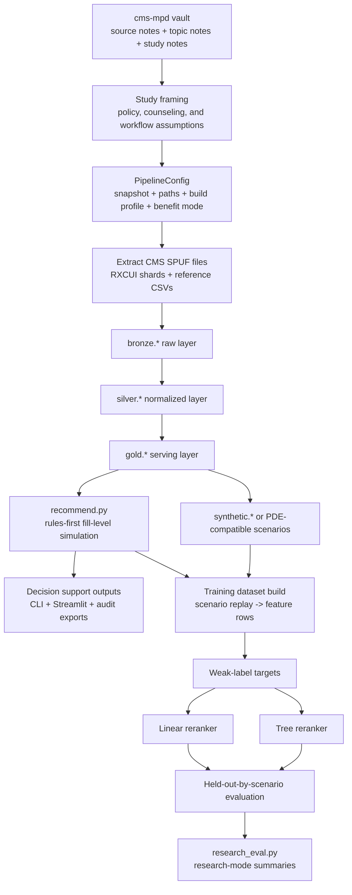

# CMS MPD Recommendation - Research Flow, Data Logic, and Algorithm

> [!note]
> This note is the methods companion to the revised manuscript drafts. It combines the updated `cms-mpd` knowledge base with direct inspection of the local `CMS-MPD-Recommendation` implementation and current training artifacts.

## Why This Note Exists

This study is easy to misdescribe if the workflow is compressed too aggressively. It is not just:

- a generic recommender,
- a claims-analysis study,
- or a UI mockup for Medicare plan comparison.

It is a linked workflow in which:

1. policy and counseling evidence define the task,
2. CMS source files are transformed into a serving model,
3. beneficiary-specific cost is simulated at fill level,
4. plans are ranked with explicit coverage-aware logic,
5. machine learning reranks only within constrained safety buckets, and
6. evaluation is performed on replayed scenarios rather than observed beneficiary outcomes.

## 1. Evidence Base to Implementation Mapping

The `cms-mpd` vault is not background reading added after the system was built. It directly shapes the implementation.

| Evidence theme | What the note set says | What the system does |
| --- | --- | --- |
| Plan-selection evidence | beneficiaries often miss least-cost plans without help | full-coverage and annual-cost logic drive ranking |
| SHIP counseling | real plan comparison is workflow based and explanation dependent | outputs are grouped into counselor-readable explanation categories |
| Communication and readability | accurate Medicare information can still be hard to interpret | explanation-first outputs matter as much as numeric scores |
| Part D redesign and LIS | January 1, 2024 and January 1, 2025 changed liability materially | runtime logic resolves `2024_standard` versus `2025_redesign` |
| Insulin and pricing distortions | beneficiary cost is not captured by premium or generic status alone | simulation is done at the drug-fill-channel level |
| Operations and oversight | sponsor bids, formularies, files, and enrollment rules shape what plans can do | the study is grounded in public CMS file structure and plan operations |

## 2. End-to-End Research Flow

### Operational sequence

1. `PipelineConfig` resolves where inputs live, where outputs are written, which snapshot is active, and which benefit-design mode to use.
2. `extract.py` finds CMS archives and reference files, then extracts archive members to `data/staging/<snapshot>/raw`.
3. `pipeline.py` builds `bronze`, `silver`, `gold`, and ensures `synthetic` exists.
4. `recommend.py` reads the gold serving layer, simulates fill-level cost, and returns ranked plans with explanation groups and fill traces.
5. `scripts/generate_beneficiary_profiles.py` optionally populates synthetic or PDE-compatible scenario tables.
6. `modeling.py` replays recommendation scenarios into a feature dataset, computes weak labels, fits rerankers, and evaluates them.
7. `research_eval.py` reshapes evaluation outputs for research mode.

## 3. Data Logic and Transformation

### 3.1 Source families

The implementation combines five source families:

1. CMS SPUF plan, formulary, pricing, pharmacy-network, geography, exclusion, indication, and beneficiary-cost files
2. RXCUI property shards for preferred names and synonyms
3. `insulin_ref.csv` for insulin identification
4. `us_zipcode_geo.csv` for ZIP centroids, population, and density
5. `pde.csv` for utilization defaults and scenario support

The last source family is methodologically important. PDE data are used for defaults and research scenarios, not as direct production truth for live beneficiary recommendations.

### 3.2 Canonical keys

The main business keys are:

| Key | Construction or role | Why it matters |
| --- | --- | --- |
| `plan_key` | `CONTRACT_ID + PLAN_ID + SEGMENT_ID` with blank segment normalized to `000` | stable plan grain across files |
| `contract_plan_key` | `CONTRACT_ID + PLAN_ID` | needed when CMS files omit segment |
| `formulary_id` | plan formulary identifier | connects plans to formulary rows |
| `zip_code` | normalized five-digit ZIP | beneficiary and pharmacy geography grain |
| `county_code` | CMS county identifier | links ZIPs to plan service areas |
| `ndc` | normalized 11-digit drug code | price and formulary grain |
| `rxcui` | normalized RxNorm concept id | medication identity and name resolution |
| `days_supply` | normalized to `30`, `60`, or `90` | standardizes pricing and cost rules |

If these keys are wrong, every downstream recommendation is wrong. The core discipline of the pipeline is preserving these grains across transformations.

### 3.3 Bronze layer

`bronze.*` keeps source files close to raw form while attaching lineage fields:

- `source_file`
- `snapshot_quarter`
- `load_ts`

Important behavior:

- ingestion is string-first and permissive to reduce schema breakage from CMS variation;
- pharmacy-network loading is intentionally fault tolerant because split files can contain malformed rows;
- extraction assumes one member file per CMS archive.

### 3.4 Silver layer

`silver.*` is where business interpretation happens.

| Table | Main logic | Study role |
| --- | --- | --- |
| `silver.dim_plan` | canonicalizes plan identity, premium, deductible, formulary id, plan type, service-area type | plan identity source of truth |
| `silver.dim_zipcode` | normalizes ZIP, county, state, lat/lng, density, county code | geography and distance base |
| `silver.bridge_plan_service_area` | maps county-based MA and region-based PDP service areas into one county bridge | plan eligibility logic |
| `silver.dim_drug_reference` | merges formulary drug rows, insulin mappings, and RXCUI names or synonyms | drug search and medication resolution |
| `silver.drug_utilization_defaults` | derives default quantity and annual fill frequency from PDE behavior | lets recommendations run without full manual quantity entry |
| `silver.fact_plan_drug_coverage` | joins formulary membership, pricing, UM flags, exclusions, indication restrictions, insulin flag | main plan x drug x day-supply fact table |
| `silver.fact_plan_pharmacy` | normalizes retail and mail access, fees, floor prices, in-area status, geolocation | channel simulation and access logic |
| `silver.plan_beneficiary_cost_rules` | normalizes standard beneficiary cost-sharing rules | standard cost simulation |
| `silver.plan_insulin_cost_rules` | normalizes insulin override copays | insulin-specific branch |

### 3.5 Gold layer

`gold.*` is the runtime-serving model used by recommendation, UI flows, and modeling code.

| Table | Main role |
| --- | --- |
| `gold.plan_service_area` | eligible plans by ZIP |
| `gold.plan_channel_summary` | plan-level retail and mail counts, fees, and floor prices |
| `gold.plan_preferred_pharmacy_locations` | preferred retail points used for nearest-distance estimates |
| `gold.plan_formulary_summary` | formulary breadth, insulin share, PA/ST/QL rates, excluded rate, restrictiveness class |
| `gold.plan_network_summary` | maps channel counts into `adequate`, `limited_preferred_retail`, or `no_preferred_retail` |
| `gold.plan_drug_cost_basis` | runtime-ready plan x drug x day-supply cost basis with joined rules and insulin overrides |
| `gold.plan_summary` | compact plan summary with premium, deductible, and service-area breadth |
| `gold.drug_input_defaults` | serving copy of quantity and fills-per-year defaults |
| `gold.recommendation_features` | compact feature table for modeling |

`gold.plan_drug_cost_basis` is the pivotal table for the study. It is where coverage facts, pricing, tier data, standard rules, and insulin override logic become one runtime-ready plan-drug record.

### 3.6 What is raw truth, what is derived, and what is approximate

The repository makes the most sense when three categories are separated.

#### Raw truth

- CMS SPUF plan, formulary, pricing, pharmacy, geography, and cost-rule files
- RXCUI property shards
- insulin reference
- ZIP reference

#### Deterministic derivation

- plan keys and contract-plan keys
- ZIP-to-county mapping
- plan service-area expansion
- formulary summary metrics
- network flags
- plan-drug cost basis
- contract-year-aware benefit-design resolution

#### Approximation

- PDE-based quantity defaults and `fills_per_year`
- ZIP-centroid preferred-pharmacy distance
- negotiated-price proxy
- weak-label target generation
- synthetic beneficiary generation

This separation is the right way to describe the study in a manuscript. It shows why the system is auditable while still being explicit about where approximation enters.

### 3.7 Mathematical view of data transformation

The end-to-end data flow can be written as a composition of transformation operators:

$$
\mathcal{R}
\xrightarrow{\mathcal{B}}
\mathcal{B}(\mathcal{R})
\xrightarrow{\mathcal{S}}
\mathcal{S}(\mathcal{B}(\mathcal{R}))
\xrightarrow{\mathcal{G}}
\mathcal{G}(\mathcal{S}(\mathcal{B}(\mathcal{R})))
\xrightarrow{\mathcal{Q}_b}
\Pi_b,
$$

where:

- $\mathcal{R}$ is the family of raw CMS, RXCUI, and reference inputs;
- $\mathcal{B}$ is bronze ingestion with lineage preservation;
- $\mathcal{S}$ is silver normalization;
- $\mathcal{G}$ is gold serving-layer materialization;
- $\mathcal{Q}_b$ is the beneficiary-specific query and recommendation operator for beneficiary $b$;
- $\Pi_b$ is the ranked plan set returned for that beneficiary.

At the table level, the core transformation from raw plan and drug files into runtime cost records is:

$$
\text{SilverCoverage}
=
\gamma_{plan\_key, ndc, s}
\Big(
\text{DimPlan}
\bowtie_{formulary\_id}
\text{Formulary}
\bowtie_{plan\_key, ndc, s}
\text{Pricing}
\overset{\text{left}}{\bowtie}
\text{Exclusions}
\overset{\text{left}}{\bowtie}
\text{IndicationCoverage}
\overset{\text{left}}{\bowtie}
\text{DrugReference}
\Big),
$$

where $s$ denotes normalized day supply. This single relation is where plan identity, formulary membership, pricing, restrictions, exclusion signals, and drug identity are aligned at a common grain.

The runtime cost basis is then:

$$
\text{GoldCostBasis}
=
\text{SilverCoverage}
\overset{\text{left}}{\bowtie}
\text{BenefitRules}
\overset{\text{left}}{\bowtie}
\text{InsulinRules},
$$

which shows how policy rules become executable data. In other words, the benefit manual and CMS rule files are not only narrative guidance. They become joined rule tensors indexed by plan, tier, day supply, channel, and coverage level.

Eligibility is likewise a transformation:

$$
\text{EligiblePlans}(z)
=
\sigma_{zip\_code = z}
\big(
\text{PlanServiceArea}
\bowtie
\text{PlanSummary}
\bowtie
\text{PlanNetworkSummary}
\big),
$$

where $z$ is the beneficiary ZIP code. The recommendation engine never starts from all plans nationally. It starts from the service-area-constrained set implied by the transformed data.

## 4. Runtime Recommendation Algorithm

### 4.1 Input normalization

The runtime contract includes:

- ZIP code
- age band
- LIS status
- chronic-condition flags
- pharmacy preference
- user role
- decision focus
- medication list

Medication resolution order is:

1. exact NDC
2. exact RXCUI
3. exact preferred name
4. exact synonym
5. prefix match

Approximate matches are preserved as evidence gaps rather than silently treated as exact truth.

### 4.2 Candidate-plan selection

The engine first limits the plan universe to the beneficiary ZIP by querying `gold.plan_service_area`, then joins `gold.plan_summary` and `gold.plan_network_summary`. Recommendation therefore starts from geographically eligible plans, not from all national plans.

### 4.3 Medication defaults and fill expansion

For each medication:

1. day supply is normalized to `30`, `60`, or `90`;
2. tier family is inferred if needed;
3. quantity and fills-per-year defaults are pulled from `gold.drug_input_defaults`.

The fallback annual-fill rule is:

$$
\text{fills per year} = \left\lceil \frac{365}{\text{days supply}} \right\rceil
$$

The system then expands each medication into annual fill events. That matters because deductible use and annual OOP accumulation are path dependent.

If medication $d$ has $n_d$ fills per year, its fill schedule can be written as:

$$
E_d = \left\{ \left(k, \operatorname{round}\left((k-1)\frac{365}{n_d}\right) \right) : k = 1, \dots, n_d \right\}.
$$

### 4.4 Channel-specific cost simulation

For each fill, the engine evaluates feasible channels among:

- `pref_retail`
- `nonpref_retail`
- `pref_mail`
- `nonpref_mail`

The negotiated-price proxy is:

$$
\text{negotiated} = \max(\text{unit cost} \times \text{quantity} + \text{dispensing fee}, \text{floor price})
$$

For plan $p$, drug $d$, fill $k$, and channel $c$, the same quantity can be written more formally as:

$$
g_{pdkc} = \max(u_{pds} q_{dk} + f_{pc\tau s}, \phi_{pc}),
$$

where $u_{pds}$ is unit cost, $q_{dk}$ is fill quantity, $f_{pc\tau s}$ is channel-specific dispensing fee for tier family $\tau$ and day supply $s$, and $\phi_{pc}$ is the channel floor price.

The engine then applies:

1. deductible handling when applicable;
2. standard beneficiary cost-sharing or insulin overrides;
3. LIS adjustments;
4. annual OOP-cap enforcement in the 2025 branch.

The cheapest feasible channel is selected, but a continuity rule keeps the previous channel when near-tied so the simulated fill path does not switch unrealistically across adjacent fills.

The selection rule is:

$$
c^\ast_{pdk} = \arg\min_{c \in \mathcal{C}_{pdb}} o_{pdkc},
$$

where $\mathcal{C}_{pdb}$ is the feasible channel set and $o_{pdkc}$ is final beneficiary OOP. The implementation then applies a near-tie continuity rule with tolerance $\epsilon = 1.00$ dollars before breaking ties by preferred-channel status and pharmacy preference.

### 4.5 Benefit-design branches

The code explicitly resolves benefit design.

- `2024_standard` uses the historical phase structure, including the initial coverage limit and coverage-gap logic.
- `2025_redesign` applies deductible handling, standard or insulin rules, LIS adjustments, and a `$2,000` annual cap.
- `auto` resolves by contract year when available, otherwise by snapshot year.

This contract-year logic is a direct response to the updated policy notes. The repository is not treating 2024 and 2025 as one interchangeable benefit structure.

The 2025 branch is a state update on remaining deductible $D_{k-1}$ and accumulated OOP $O_{k-1}$:

$$
\delta_{pdkc} = \min(g_{pdkc}, D_{k-1}),
$$

$$
c^{base}_{pdkc} =
\begin{cases}
\delta_{pdkc} + \psi(g_{pdkc} - \delta_{pdkc}; \theta^{init}_{pc}), & \text{standard drug} \\
\min(\theta^{ins}_{pc}, g_{pdkc}), & \text{insulin override available,}
\end{cases}
$$

where $\psi(\cdot;\theta)$ is the CMS copay-or-coinsurance rule function implied by the joined beneficiary-cost tables.

LIS adjustment is then:

$$
L(c,\ell,\tau)=
\begin{cases}
\min(c, 4.90), & \ell=\text{full},\ \tau=\text{generic} \\
\min(c, 12.15), & \ell=\text{full},\ \tau=\text{brand} \\
\min(0.75c, 12.00), & \ell=\text{partial},\ \tau=\text{generic} \\
\min(0.75c, 35.00), & \ell=\text{partial},\ \tau=\text{brand} \\
c, & \ell=\text{none},
\end{cases}
$$

and the 2025 annual cap becomes:

$$
o_{pdkc}^{2025} =
\begin{cases}
0, & O_{k-1} \geq 2000 \\
\min(L(c^{base}_{pdkc}, \ell, \tau), 2000 - O_{k-1}), & O_{k-1} < 2000.
\end{cases}
$$

The 2024 branch instead uses historical phase splitting. If total drug spending before fill $k$ is $T_{k-1}$, then:

$$
g^I_{pdkc} = \min(g_{pdkc}, \max(0, 5030 - T_{k-1})),
\qquad
g^G_{pdkc} = g_{pdkc} - g^I_{pdkc},
$$

$$
c^G_{pdkc} = 0.25 \, g^G_{pdkc}.
$$

### 4.6 Explanation generation

The runtime engine groups explanation output into:

- coverage issues
- utilization-management issues
- insulin considerations
- pharmacy-access issues
- deductible issues
- cost-logic issues

This grouping is one of the clearest places where the SHIP and readability literature shapes the implementation.

### 4.7 Baseline ranking logic

The baseline rank is rules-first, but it is not a naive sort on one score. The ordering logic is effectively:

1. fully covered and fully priceable plans first;
2. more priced drugs first;
3. higher fit score;
4. lower annual total cost;
5. fewer uncovered drugs;
6. fewer restrictions;
7. better network status.

`rules_score` is still exported and used as an important signal, but the actual baseline rank is a lexicographic coverage-aware ordering with fit-score support.

The exported rules score is:

$$
R_p =
10000 \, \mathbf{1}\{\text{coverage}_p = \text{full}\}
- T_p
- 250U_p
- 35H_p
- 20N_p,
$$

where $T_p$ is annual total cost, $U_p$ is uncovered-drug count, $H_p$ is restriction count, and $N_p$ is the network-priority penalty.

The baseline ranking can therefore be written as:

$$
\pi_{\text{rules}} =
\operatorname{lexsort}
\left(
\kappa(p),
-n_p^{priced},
-F_p,
T_p,
U_p,
H_p,
N_p,
\text{name}_p
\right),
$$

where $\kappa(p)\in\{0,1,2\}$ is the recommendation bucket and $F_p$ is the fit score.

The fit score is a weighted sum:

$$
F_p = w_c S_p^{cost}
+ w_m S_p^{premium}
+ w_v S_p^{coverage}
+ w_a S_p^{access}
+ w_s S_p^{stability},
$$

with weights determined by decision focus and user role:

$$
w_j =
\frac{\max(0, w_j^{focus} + \Delta_j^{role})}
{\sum_{r}\max(0, w_r^{focus} + \Delta_r^{role})}.
$$

The coverage, access, and stability components are explicit penalty functions:

$$
S_p^{coverage}
=
\operatorname{clip}\left(
100
- 22\mathbf{1}\{\text{coverage}_p \neq \text{full}\}
- 10U_p^{only}
- 18E_p
- 14M_p
- 12C_p,
0,100\right),
$$

$$
S_p^{access}
=
\operatorname{clip}\left(
B_p
- D_p
- 6\Sigma_p
- 6\max(M_p^{mail}-1,0)
- P_p^{pref},
0,100\right),
$$

$$
S_p^{stability}
=
\operatorname{clip}\left(
100
- 9H_p
- 8\Sigma_p
- \Pi_p^{ded}
- 4C_p,
0,100\right),
$$

where $E_p$ is excluded-drug count, $M_p$ is missing-price count, $C_p$ is channel-unavailable count, $\Sigma_p$ is channel-switch count, $B_p$ is the network-base access score, and $\Pi_p^{ded}$ is deductible-pressure penalty.

The implementation then applies a final coverage guardrail:

$$
F_p \leftarrow
\begin{cases}
\max(F_p, 60 + 0.15S_p^{coverage}), & \text{coverage}_p = \text{full} \\
\min(F_p, 59), & \text{otherwise.}
\end{cases}
$$

## 5. Research Workflow

### 5.1 Scenario generation

The project does not train on observed beneficiary-choice data. It creates recommendation scenarios from:

1. `synthetic.*` tables when they exist;
2. fallback scenario templates otherwise.

The repository also supports PDE-compatible scenario generation through `scripts/generate_beneficiary_profiles.py`, which derives regimen-level defaults from PDE rows and maps them back to the formulary and RXCUI reference space.

### 5.2 Training-dataset construction

For each scenario, `modeling.py`:

1. runs `recommend_plans(..., ranking_mode="rules")`;
2. converts each returned plan into one feature row;
3. enriches the row with `gold.recommendation_features`;
4. computes weak-label and heuristic scores;
5. computes within-scenario rank and relevance.

This means the training dataset is not raw CMS data and not raw claims data. It is a replay dataset built from simulated recommendation outcomes.

### 5.3 Weak labels and model families

The current code declares:

- dataset schema version `request_features_v4`
- weak-label version `weak_label_v2`

The weak-label target strongly rewards full coverage and penalizes higher annual total cost, uncovered drugs, exclusions, missing-price rows, channel-unavailable drugs, restrictions, approximate matches, mail dependency, insulin risk, and network risk.

More formally:

$$
W_p =
1000\,\mathbf{1}\{\text{coverage}_p=\text{full}\}
+ R_p
- T_p
- 250U_p
- 125E_p
- 110M_p
- 90C_p
- 25H_p
- 20A_p
- 18Mail_p
- 15Ins_p
- 12InsNP_p
- 20Net_p.
$$

The simpler heuristic baseline is:

$$
H_p^{heur} =
500\,\mathbf{1}\{\text{coverage}_p=\text{full}\}
+ R_p
- T_p
- 200U_p
- 30H_p
- 10Net_p.
$$

The repository supports two reranker families:

- a transparent linear reranker based on ridge regression over encoded features;
- a small additive regression-tree ensemble that captures non-linear interactions.

### 5.4 Hybrid safety constraint

The ML layer is not free to reorder the whole candidate set. Hybrid inference first separates plans into coverage-oriented buckets, then reranks only within those buckets. This is one of the most important safety decisions in the codebase because it prevents a learned score from overriding the primary coverage hierarchy.

If $\hat{W}_p$ is the model score, the hybrid ranking is:

$$
\pi_{\text{hybrid}} =
\bigcup_{b \in \{0,1,2\}}
\operatorname{sort}_{p \in \mathcal{B}_b}
\left(
-\hat{W}_p,
-n_p^{priced},
-R_p,
T_p,
U_p,
H_p,
\text{name}_p
\right),
$$

where $\mathcal{B}_0$, $\mathcal{B}_1$, and $\mathcal{B}_2$ are the full-priceable, partially priceable, and fallback buckets respectively.

### 5.5 Evaluation design

Evaluation uses a held-out-by-scenario split rather than a random row split. That is methodologically stronger because all rows from one scenario stay together in either train or test.

Reported metrics include:

- top-1 agreement
- top-5 overlap
- top-10 overlap
- NDCG@5 and NDCG@10
- top-5 and top-10 full-coverage rate
- top-5 and top-10 average total cost
- top-5 average uncovered-drug count

Acceptance checks are intentionally simple:

- top-5 overlap should not worsen;
- top-10 overlap should not worsen;
- top-5 uncovered burden should not worsen.

## 6. Current Artifact State and Reproducibility

The checked-in evaluation JSON reports:

- `1774` dataset rows
- `32` scenarios
- `22` training scenarios
- `10` test scenarios
- held-out evaluation with seed `42` and test fraction `0.3`

Reported system means are:

| System | Top-1 | Top-5 overlap | Top-10 overlap | NDCG@5 | Top-5 avg uncovered |
| --- | --- | --- | --- | --- | --- |
| `rules_only` | `0.60` | `0.98` | `0.88` | `0.893` | `0.10` |
| `heuristic_baseline` | `0.70` | `1.00` | `0.91` | `0.912` | `0.10` |
| `linear_reranker` | `0.80` | `0.88` | `0.88` | `0.924` | `0.10` |
| `tree_reranker` | `1.00` | `1.00` | `0.97` | `1.000` | `0.10` |

One reproducibility caveat matters. The evaluation JSON already reports `request_features_v4`, but the checked-in dataset metadata file still reports older markers such as `request_features_v2` and `research_v2`. The pipeline is conceptually coherent, but strict artifact reproducibility still depends on regenerating the training outputs from the current code path.

## 7. How To Describe This Study In Manuscripts

The strongest description is:

- a counselor-oriented Medicare Part D decision-support system;
- a policy-aware and auditable cost-simulation pipeline;
- an explanation-first ranking workflow;
- a research platform for constrained reranking.

The weakest description is:

- a novel generic recommender;
- a validated beneficiary-outcome predictor;
- a claims-adjudication-equivalent pricing engine.

The central methodological decision is the order of operations:

1. transform CMS sources into a serving model;
2. simulate cost and coverage first;
3. explain tradeoffs in counselor-readable categories;
4. rank with explicit coverage-aware rules;
5. allow machine learning only to rerank within constrained safety buckets.

That order is what makes the study coherent with the updated `cms-mpd` evidence base.

## 8. Related Notes

- [[CMS MPD Recommendation - Journal Manuscript Draft]]
- [[CMS MPD Recommendation - Research Manuscript Draft]]
- [[Source - Plan Selection and Decision Support Evidence]]
- [[Source - SHIP Counseling and Beneficiary Navigation]]
- [[Source - Part D Reform and IRA Timeline]]
- [[Source - Extra Help and LIS Operations]]
- [[Source - Insulin Affordability in Part D]]
- [[Source - Drug Pricing and Formulary Distortions]]
- [[Source - Part D Operations, Enrollment, and Bidding Guidance]]
- [[Source - MedPAC Part D Status Reports and Oversight]]
- [[Source - Medicare Communication and Beneficiary Readability]]
