# CMS-MPD Architecture And Lineage

This page summarizes the end-to-end technical architecture, medallion flow, and table-level lineage for `CMS-MPD-Recommendation`.

## One-Page Architecture

```mermaid
flowchart LR
    subgraph Raw["Local source snapshot"]
        CMS["CMS SPUF Q3 2025 archives
plan / formulary / pricing / pharmacy / geography / exclusions / UM / insulin rules"]
        RX["RXCUI property CSV shards"]
        REF["Reference CSVs
insulin_ref / us_zipcode_geo / pde"]
    end

    subgraph Bronze["DuckDB bronze.*"]
        B1["plan_information"]
        B2["basic_formulary"]
        B3["pricing"]
        B4["pharmacy_network"]
        B5["beneficiary_cost"]
        B6["insulin_beneficiary_cost"]
        B7["geographic_locator"]
        B8["excluded_drugs"]
        B9["indication_coverage"]
        B10["rxcui_properties"]
        B11["insulin_reference"]
        B12["us_zipcode_geo"]
        B13["pde_sample"]
    end

    subgraph Silver["DuckDB silver.*"]
        S1["dim_plan"]
        S2["dim_zipcode"]
        S3["bridge_plan_service_area"]
        S4["build_plan_scope"]
        S5["dim_drug_reference"]
        S6["drug_utilization_defaults"]
        S7["fact_plan_drug_coverage"]
        S8["fact_plan_pharmacy"]
        S9["plan_beneficiary_cost_rules"]
        S10["plan_insulin_cost_rules"]
    end

    subgraph Gold["DuckDB gold.*"]
        G1["plan_service_area"]
        G2["plan_channel_summary"]
        G3["plan_preferred_pharmacy_locations"]
        G4["plan_formulary_summary"]
        G5["plan_network_summary"]
        G6["plan_drug_cost_basis"]
        G7["plan_summary"]
        G8["drug_input_defaults"]
        G9["recommendation_features"]
        G10["ui_plan_drug_serving"]
        G11["ui_plan_comparison_base"]
    end

    subgraph Synthetic["DuckDB synthetic.*"]
        Y1["syn_beneficiary"]
        Y2["syn_beneficiary_prescriptions"]
    end

    subgraph Runtime["Serving + research"]
        R1["recommend.py
rules-first OOP simulation"]
        R2["modeling.py
dataset build + reranker"]
        R3["research_eval.py
evaluation summaries"]
        R4["streamlit_app.py
counselor workflow"]
    end

    CMS --> Bronze
    RX --> Bronze
    REF --> Bronze

    Bronze --> Silver
    Silver --> Gold
    Silver --> Synthetic
    Gold --> R1
    Gold --> R2
    Gold --> R4
    Synthetic --> R2
    R1 --> R2
    R2 --> R3
    R1 --> R4
```

## Transformation Logic

| Stage | Key logic | Output |
|---|---|---|
| Extract | Unzips CMS archive members into `data/staging/<snapshot>/raw` and locates reference CSVs and RXCUI shards. | `SourcePaths` |
| Bronze | Loads raw text or CSV sources with lineage metadata. Pharmacy network ingestion is intentionally fault tolerant to survive malformed CMS split rows. | `bronze.*` |
| Silver | Normalizes reusable entities: plan grain, ZIP-to-county geography, service-area bridge, drug reference, PDE defaults, plan-drug coverage, pharmacy facts, and beneficiary or insulin cost rules. | `silver.*` |
| Gold | Builds the serving layer used by inference and modeling: ZIP eligibility, formulary breadth and restrictiveness, pharmacy channel metrics, network status, per-drug cost basis, and compact plan-level features. | `gold.*` |
| Synthetic | Creates synthetic or PDE-derived beneficiary regimens with ZIP geography and formulary-aware drug distributions for model training scenarios. | `synthetic.*` |
| Runtime | Simulates fill-level OOP with contract-year-aware benefit design selection, ranks plans by rules and fit score, optionally reranks with the hybrid model, and surfaces counselor-ready outputs and research summaries. | Streamlit, CLI, evaluation reports |

## Table-By-Table Lineage

### Bronze

| Table | Grain | Built from | Purpose | Main downstream |
|---|---|---|---|---|
| `bronze.plan_information` | raw plan rows | CMS plan information archive | base plan identity, premium, deductible, service-area attributes | `silver.dim_plan`, `silver.bridge_plan_service_area` |
| `bronze.basic_formulary` | raw formulary rows | CMS formulary archive | formulary drug membership, tier, PA/ST/QL | `silver.dim_drug_reference`, `silver.fact_plan_drug_coverage` |
| `bronze.beneficiary_cost` | raw cost-rule rows | CMS beneficiary cost archive | pre-deductible and initial-coverage rules by tier and day supply | `silver.plan_beneficiary_cost_rules` |
| `bronze.insulin_beneficiary_cost` | raw insulin copay rows | CMS insulin cost archive | insulin-specific copay overrides | `silver.plan_insulin_cost_rules` |
| `bronze.pricing` | raw plan-drug-price rows | CMS pricing archive | observed `unit_cost` by plan, NDC, and day supply | `silver.fact_plan_drug_coverage` |
| `bronze.geographic_locator` | raw region and county rows | CMS geographic locator archive | county and PDP region mapping | `silver.dim_zipcode`, `silver.bridge_plan_service_area` |
| `bronze.excluded_drugs` | raw excluded rows | CMS excluded drug archive | formulary exclusion flags | `silver.fact_plan_drug_coverage` |
| `bronze.indication_coverage` | raw indication rows | CMS indication coverage archive | disease-specific coverage restrictions | `silver.fact_plan_drug_coverage` |
| `bronze.pharmacy_network` | raw pharmacy rows | CMS pharmacy network split archives | pharmacy channel inventory, fees, floor prices, in-area flags | `silver.fact_plan_pharmacy` |
| `bronze.rxcui_properties` | raw RXCUI rows | RXCUI property shards | preferred names, synonyms, term types | `silver.dim_drug_reference` |
| `bronze.insulin_reference` | raw insulin mapping rows | `insulin_ref.csv` | insulin NDC/RXCUI reference | `silver.dim_drug_reference` |
| `bronze.us_zipcode_geo` | raw ZIP rows | `us_zipcode_geo.csv` | ZIP centroid, density, population, county text | `silver.dim_zipcode` |
| `bronze.pde_sample` | raw PDE event rows | `pde.csv` | quantity and day-supply behavior for defaults | `silver.drug_utilization_defaults` |

### Silver

| Table | Grain | Built from | Purpose | Main downstream |
|---|---|---|---|---|
| `silver.state_lookup` | state abbreviation | inline mapping | stable state-name normalization helper | `silver.dim_zipcode` |
| `silver.dim_plan` | `plan_key` | `bronze.plan_information` | canonical plan dimension with premium, deductible, plan type, and formulary id | `silver.bridge_plan_service_area`, `silver.fact_plan_drug_coverage`, `gold.plan_summary` |
| `silver.dim_zipcode` | ZIP code | `bronze.us_zipcode_geo`, `bronze.geographic_locator`, `silver.state_lookup` | ZIP centroid, county code, density category | `silver.bridge_plan_service_area`, `silver.fact_plan_pharmacy`, `gold.plan_service_area`, distance lookups |
| `silver.bridge_plan_service_area` | plan-county pair | `silver.dim_plan`, `bronze.plan_information`, `bronze.geographic_locator` | normalizes county-based MA plans and PDP region plans onto county service areas | `silver.build_plan_scope`, `gold.plan_service_area`, `gold.plan_summary` |
| `silver.build_plan_scope` | `plan_key` | `silver.dim_plan`, `silver.bridge_plan_service_area`, `silver.dim_zipcode` | limits demo builds to configured ZIPs while preserving a fallback full scope | most silver and gold build steps |
| `silver.dim_drug_reference` | NDC/RXCUI pair | `bronze.basic_formulary`, `bronze.insulin_reference`, `bronze.rxcui_properties` | normalized drug identity with preferred name, synonym, and insulin flag | `silver.fact_plan_drug_coverage`, drug search, recommendation matching |
| `silver.drug_utilization_defaults` | NDC or fallback x day supply x tier family | `bronze.pde_sample`, `bronze.basic_formulary` | default quantity and annual fill frequency derived from PDE behavior | `gold.drug_input_defaults`, medication defaulting |
| `silver.fact_plan_drug_coverage` | plan x NDC x day supply | `silver.dim_plan`, `silver.build_plan_scope`, `bronze.basic_formulary`, `bronze.pricing`, `bronze.excluded_drugs`, `bronze.indication_coverage`, `silver.dim_drug_reference` | combines formulary coverage, pricing, UM flags, exclusion, indication, and insulin information | `gold.plan_formulary_summary`, `gold.plan_drug_cost_basis`, synthetic generation |
| `silver.fact_plan_pharmacy` | plan x pharmacy | `bronze.pharmacy_network`, `silver.build_plan_scope`, `silver.dim_zipcode` | normalized in-area retail/mail network facts, fees, floors, and pharmacy geolocation | `gold.plan_channel_summary`, `gold.plan_preferred_pharmacy_locations` |
| `silver.plan_beneficiary_cost_rules` | plan x coverage level x tier x day supply | `bronze.beneficiary_cost`, `silver.build_plan_scope` | normalized CMS cost-sharing rules by preferred and nonpreferred retail or mail channels | `gold.plan_drug_cost_basis` |
| `silver.plan_insulin_cost_rules` | plan x tier x day supply | `bronze.insulin_beneficiary_cost`, `silver.build_plan_scope` | insulin-specific copay override schedule | `gold.plan_drug_cost_basis` |

### Gold

| Table | Grain | Built from | Purpose | Main downstream |
|---|---|---|---|---|
| `gold.plan_service_area` | ZIP x plan | `silver.dim_zipcode`, `silver.bridge_plan_service_area`, `silver.dim_plan` | eligible plans for a beneficiary ZIP | `recommend.py`, scenario generation |
| `gold.plan_channel_summary` | `plan_key` | `silver.fact_plan_pharmacy` | preferred or nonpreferred retail/mail counts, floor prices, and minimum dispensing fees | fill simulation in `recommend.py`, `gold.plan_network_summary` |
| `gold.plan_preferred_pharmacy_locations` | plan x preferred retail pharmacy | `silver.fact_plan_pharmacy` | lat/lng points for preferred in-area retail stores | distance-to-preferred calculations |
| `gold.plan_formulary_summary` | `plan_key` | `silver.fact_plan_drug_coverage` | formulary breadth, insulin count, generic or specialty mix, PA/ST/QL rates, excluded rate, insulin coverage pct, restrictiveness class | `gold.plan_summary`, `gold.recommendation_features` |
| `gold.plan_network_summary` | `plan_key` | `gold.plan_channel_summary` | derives `adequate`, `limited_preferred_retail`, or `no_preferred_retail` | `recommend.py`, `gold.recommendation_features`, UI outputs |
| `gold.plan_drug_cost_basis` | plan x NDC x day supply | `silver.fact_plan_drug_coverage`, `silver.dim_drug_reference`, `silver.plan_beneficiary_cost_rules`, `silver.plan_insulin_cost_rules` | runtime-ready cost basis combining price, tier, UM flags, deductible applicability, standard rules, and insulin overrides | `recommend.py`, scenario generation, drug search support |
| `gold.plan_summary` | `plan_key` | `silver.dim_plan`, `silver.bridge_plan_service_area`, `gold.plan_formulary_summary` | plan-level serving dimension with premium, deductible, service-area size, and formulary metrics | `recommend.py`, UI comparison views, `gold.recommendation_features` |
| `gold.drug_input_defaults` | same as silver defaults | `silver.drug_utilization_defaults` | serving copy of medication quantity and fills defaults | medication normalization in `recommend.py` |
| `gold.recommendation_features` | `plan_key` | `gold.plan_summary`, `gold.plan_network_summary` | compact plan-level feature table for dataset generation and hybrid reranking | `modeling.py` |
| `gold.ui_plan_drug_serving` | plan x NDC x day supply | `gold.plan_drug_cost_basis`, `gold.plan_summary`, `gold.plan_network_summary` | lightweight UI and debug view for plan-drug inspection | Streamlit drill-downs |
| `gold.ui_plan_comparison_base` | `plan_key` | `gold.plan_summary`, `gold.plan_network_summary` | lightweight UI and export view for side-by-side plan comparison | Streamlit results and comparison exports |

### Synthetic

| Table | Grain | Built from | Purpose | Main downstream |
|---|---|---|---|---|
| `synthetic.syn_beneficiary` | synthetic beneficiary | generated from sampled ZIPs and either simulated or PDE-derived regimen totals | stores geography, risk segment, drug-count profile, and insulin-user flag | `modeling.py` scenario builder |
| `synthetic.syn_beneficiary_prescriptions` | synthetic beneficiary x drug | `silver.fact_plan_drug_coverage`, RXCUI reference, or matched PDE rows | stores medication mix, day supply, quantities, annual fills, UM flags, insulin flag, and source mode | `modeling.py` scenario builder |

## Runtime Lineage

| Consumer | Reads | Purpose |
|---|---|---|
| `recommend_plans()` | `gold.plan_service_area`, `gold.plan_summary`, `gold.plan_network_summary`, `gold.plan_channel_summary`, `gold.plan_drug_cost_basis`, `gold.drug_input_defaults`, `silver.dim_drug_reference`, `silver.dim_zipcode`, `gold.plan_preferred_pharmacy_locations` | resolves medications, simulates per-fill OOP, ranks plans, and explains tradeoffs |
| `build_training_dataset()` | `gold.plan_service_area`, `gold.plan_drug_cost_basis`, `gold.recommendation_features`, `silver.dim_zipcode`, `synthetic.*`, `recommend_plans()` | generates scenario-level plan-ranking rows for model training |
| `train_hybrid_reranker()` | training CSV generated by `build_training_dataset()` | fits linear ridge or custom boosted tree reranker |
| `evaluate_hybrid_reranker()` | training CSV and held-out scenario split metadata | fits rerankers on train scenarios only, then compares rules-only, heuristic, linear, tree, and ablation systems on held-out scenarios |
| `streamlit_app.py` | recommendation engine, decision-support helpers, `silver.dim_zipcode` for nearby comparison ZIPs | counselor-first intake, plan ranking, side-by-side compare, notes, and exports |

## Design Notes

- The rules engine is the source of truth for cost and explanation logic. The ML layer only reranks already simulated recommendation rows.
- `contract_year` is propagated from formulary input into the gold serving layer so runtime simulation can choose `2025_redesign` vs `2024_standard` explicitly and audit that choice.
- Out-of-area comparison plans are assembled in the Streamlit layer by rerunning recommendations against nearby ZIP codes, then marking those rows as comparison-only.
- `gold.plan_drug_cost_basis` is the heaviest gold build because it joins plan-drug coverage with multiple cost-rule sources at runtime-ready grain.
