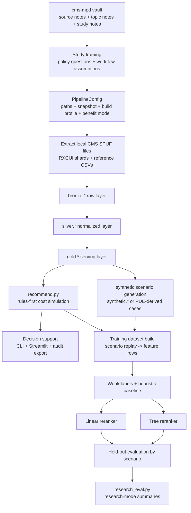

# CMS-MPD Study Research Flow, Data Logic, and Algorithm

This document explains the study as it actually exists in this repository: a counselor-oriented Medicare Part D decision-support system, a local analytical pipeline, and a research workflow for constrained reranking. It uses the `cms-mpd` vault as the policy and evidence framing layer, and the code under `src/cms_mpd/` plus `scripts/` as the implementation ground truth.

## 1. What This Study Is

The study is not a generic recommender-systems paper that happens to mention Medicare. It is a domain-specific decision-support study built around one concrete problem:

- given a beneficiary ZIP code, medication list, LIS status, and pharmacy preference, identify which Part D plans are the safest and most affordable fits
- explain the tradeoffs in language a counselor or beneficiary can act on
- evaluate whether a constrained reranker can improve the ordering of already-simulated plans without weakening coverage safety

In practice, the repository contains three linked layers:

1. a curated policy and evidence knowledge base in `cms-mpd/`
2. a DuckDB medallion pipeline that turns CMS SPUF files into serving tables
3. a rules-first recommendation engine with an optional hybrid reranker and a research evaluation path

## 2. How The `cms-mpd` Knowledge Base Shapes The Study

The `cms-mpd` vault is not just background reading. It drives the study design.

| Vault theme | What the notes say | What the implementation does |
|---|---|---|
| Plan selection evidence | Beneficiaries often do not choose the lowest-total-cost or most suitable plan without guidance. | Ranking logic prioritizes complete coverage and total cost over premium-only heuristics. |
| SHIP counseling | Real plan comparison is a counseling workflow, not just a score table. | The engine groups explanations into coverage, utilization management, insulin, pharmacy access, deductible, and cost-logic categories. |
| Part D redesign and IRA timeline | January 1, 2024 and January 1, 2025 changed beneficiary liability materially. | Runtime logic explicitly resolves `2025_redesign` versus `2024_standard` benefit design. |
| LIS / Extra Help | Subsidy status changes what the beneficiary actually pays. | Fill-cost simulation applies full or partial LIS adjustments after base cost is computed. |
| Insulin affordability | Insulin is a high-value policy case with distinct beneficiary protections. | Separate insulin override tables and insulin-specific explanation rules are carried into the serving layer. |
| Pricing and formulary distortions | List price, generic status, and beneficiary OOP do not map cleanly to one another. | The engine simulates plan-specific drug cost at the fill and channel level instead of assuming generic = cheaper. |
| Communication and readability | Beneficiaries need interpretable explanations, not only technically correct data. | Outputs are explanation-first and counselor-facing, with confidence bands, evidence gaps, and audit exports. |

The result is a study that is better understood as a health decision-support systems study than as a pure machine-learning ranking paper.

## 3. End-To-End Research Flow

### 3.1 Conceptual flow

### 3.2 Operational flow

1. The `cms-mpd` vault organizes imported PDFs and web captures into source notes, topic notes, and manuscript-ready syntheses.
2. `PipelineConfig` resolves where raw data lives, where outputs are written, which snapshot quarter is active, whether the build is `full` or `demo`, and which benefit design mode is active.
3. `extract.py` locates CMS SPUF archives, reference CSVs, and RXCUI shards, then extracts archive members into `data/staging/<snapshot>/raw`.
4. `pipeline.py` builds `bronze.*`, `silver.*`, `gold.*`, and ensures `synthetic.*` exists.
5. `recommend.py` reads the gold serving layer, resolves medication identity, simulates annual fill-level cost plan by plan, and returns ranked recommendations with explanation groups and detailed fill traces.
6. `scenario_generation.py` materializes canonical mixed-source scenarios in `synthetic.training_scenarios`, `synthetic.training_scenario_medications`, and `synthetic.training_scenario_manifest`.
7. `scripts/generate_beneficiary_profiles.py` remains available for legacy `synthetic.syn_*` support tables.
8. `modeling.py` replays canonical recommendation scenarios into a feature dataset, creates weak-label ranking targets, trains rerankers, and evaluates rules-only versus reranked orderings on scenario-, ZIP-, and regimen-held-out splits.
9. `research_eval.py` converts the evaluation report into frames used by research mode.

## 4. Data Logic

### 4.1 Source families

The repository combines five source families:

1. CMS SPUF quarterly plan, formulary, pricing, pharmacy, geography, exclusion, indication, and beneficiary-cost files
2. RXCUI property shards used for drug naming and synonym resolution
3. `insulin_ref.csv` for insulin identification
4. `us_zipcode_geo.csv` for ZIP centroids, population, and density
5. `pde.csv` as a utilization-default and research-scenario source, not as production beneficiary truth

### 4.2 Data contracts and canonical keys

The main business keys are:

| Key | Construction | Purpose |
|---|---|---|
| `plan_key` | `CONTRACT_ID + PLAN_ID + SEGMENT_ID` with blank segment mapped to `000` | canonical plan grain across plan, pricing, cost, and pharmacy sources |
| `contract_plan_key` | `CONTRACT_ID + PLAN_ID` | joins plan-level exclusions and indication coverage that do not carry segment grain |
| `formulary_id` | from plan information | joins plans to formulary rows |
| `zip_code` | normalized to five digits | beneficiary and pharmacy geography grain |
| `county_code` | from CMS geography | bridge between ZIPs and plan service areas |
| `ndc` | normalized to 11 digits | canonical drug-service grain for pricing and formulary facts |
| `rxcui` | normalized string | medication identity, naming, synonym, and user input resolution |
| `days_supply` | normalized into `30`, `60`, or `90` | standardization key for pricing and cost rules |
| `coverage_level` | `0` or `1` in beneficiary cost rules | separates pre-deductible from initial-coverage rule schedules |
| `tier_level_value` | integer tier value | maps coverage rows to benefit rules and tier family |

These keys are the backbone of the study. If they are wrong, every downstream recommendation is wrong.

### 4.3 Medallion logic

### Bronze: preserve raw inputs with lineage

The bronze layer keeps CMS inputs close to source format. Every bronze table adds:

- `source_file`
- `snapshot_quarter`
- `load_ts`

Important behavior:

- most bronze loads ingest strings permissively to reduce schema-break failures from CMS variation
- pharmacy network ingestion is intentionally fault tolerant with null padding and ignored malformed rows
- archive extraction assumes one member file per CMS archive

### Silver: normalize business entities

The silver layer does the business interpretation work.

Key transformations:

| Silver table | Core logic | Why it matters |
|---|---|---|
| `silver.dim_plan` | deduplicates plans, creates `plan_key`, keeps premium, deductible, plan type, formulary id, service area type | becomes the plan identity source of truth |
| `silver.dim_zipcode` | normalizes ZIP, county, state, lat/lng, density, and maps ZIP to CMS county | enables service-area lookup and pharmacy distance estimation |
| `silver.bridge_plan_service_area` | maps MA plans directly by county and PDP plans by region-to-county expansion | turns heterogeneous CMS geography into a single service-area bridge |
| `silver.build_plan_scope` | in `demo`, restricts build to ZIP-relevant plans; in `full`, keeps all plans | keeps demo builds small without changing logic |
| `silver.dim_drug_reference` | merges formulary and insulin mappings with RXCUI names and synonyms | supports drug search and medication resolution |
| `silver.drug_utilization_defaults` | derives default quantity and annual fills from PDE behavior | lets the engine price a drug even when the user does not enter quantity manually |
| `silver.fact_plan_drug_coverage` | combines formulary, pricing, UM flags, exclusions, indication restrictions, and insulin flag | this is the core plan x drug x day-supply fact table |
| `silver.fact_plan_pharmacy` | normalizes in-area and mail/retail channel data plus fees and floor prices | supports channel availability and negotiated-price approximation |
| `silver.plan_beneficiary_cost_rules` | normalizes pre-deductible and initial-coverage rules by tier and day supply | supports rules-based cost simulation |
| `silver.plan_insulin_cost_rules` | normalizes insulin-specific override copays | lets insulin be modeled differently from general drug rules |

### Gold: runtime serving model

The gold layer is what the recommendation engine and modeling code actually read.

| Gold table | Main role |
|---|---|
| `gold.plan_service_area` | eligible plans for each ZIP |
| `gold.plan_channel_summary` | plan-level retail/mail counts, minimum floor prices, and minimum dispensing fees |
| `gold.plan_preferred_pharmacy_locations` | preferred retail pharmacy points used for nearest-distance estimation |
| `gold.plan_formulary_summary` | formulary breadth, insulin share, PA/ST/QL rates, excluded rate, restrictiveness class |
| `gold.plan_network_summary` | maps raw counts to `adequate`, `limited_preferred_retail`, or `no_preferred_retail` |
| `gold.plan_drug_cost_basis` | runtime-ready plan x drug x day-supply cost basis with joined rules and insulin overrides |
| `gold.plan_summary` | compact plan summary with premium, deductible, county coverage, and formulary metrics |
| `gold.drug_input_defaults` | serving copy of medication defaults |
| `gold.recommendation_features` | compact plan-level feature table used by modeling |

### 4.4 What is raw truth, what is derived, and what is heuristic

It is important to separate three types of data logic:

### Raw truth

- CMS SPUF plan, formulary, pricing, pharmacy, geography, and cost-rule files
- RXCUI properties
- insulin reference mappings
- ZIP geography reference

### Derived but deterministic

- `plan_key`, `contract_plan_key`
- ZIP-to-county mapping
- plan service area expansion
- formulary summary metrics
- network flag
- plan-drug cost basis
- contract-year-aware benefit design resolution

### Heuristic or approximate

- county-name normalization and ZIP density buckets
- PDE-based quantity defaults and `fills_per_year`
- ZIP-centroid preferred-pharmacy distance
- negotiated-price proxy via `unit_cost * quantity + fee`, subject to channel floor
- weak-label target generation
- synthetic beneficiary and prescription generation

The study is strongest when these categories are kept distinct. The code mostly does this well.

### 4.5 Important repository-state note

The current local artifact state is aligned to the rebuilt database and the newer scenario-aware generation path:

- dataset schema: `request_features_v4`
- feature version: `research_v4`
- canonical training scenarios: `synthetic.training_*`
- default generation strategy: mixed-source
- default training policy: `student_safe`

The research workflow therefore no longer depends on an implicit synthetic-or-benchmark fallback. It materializes canonical scenarios first, then builds the reranker dataset from that scenario layer.

## 5. Recommendation Algorithm

### 5.1 Inputs

The runtime engine takes:

- beneficiary ZIP code
- age band
- LIS status
- chronic condition flags
- pharmacy preference
- user role
- decision focus
- medication list, where each medication may be specified by drug name, RXCUI, or NDC

Medication resolution order is:

1. exact NDC if provided
2. exact RXCUI if provided
3. exact preferred name
4. exact synonym
5. prefix match on preferred name or synonym

This matters because approximate matches are tracked and later surfaced as evidence gaps.

### 5.2 Candidate plan selection

Candidate plans are not pulled from all plans nationally. The engine first queries `gold.plan_service_area` for the beneficiary ZIP, then joins:

- `gold.plan_summary`
- `gold.plan_network_summary`

This guarantees that the baseline recommendation set is geographically eligible before any ranking occurs.

### 5.3 Medication normalization

For each medication:

1. day supply is normalized to `30`, `60`, or `90`
2. tier family is inferred from the gold cost basis if the input does not specify it
3. default quantity and annual fill count are pulled from `gold.drug_input_defaults`
4. the medication is converted into a resolved runtime object with `quantity` and `fills_per_year`

Default fill count logic comes from PDE-derived medians and falls back to:

\[
\text{default\_fills\_per\_year} = \left\lceil \frac{365}{\text{days\_supply}} \right\rceil
\]

### 5.4 Plan-drug setup

For each candidate plan and each resolved medication, the engine looks up:

- plan-drug-day-supply basis from `gold.plan_drug_cost_basis`
- plan channel summary from `gold.plan_channel_summary`

If the basis is missing, excluded, or lacks price, the drug is marked as:

- `uncovered`
- `excluded`
- `missing_price`

Only priceable drug-plan pairs become scheduled fill events.

### 5.5 Fill scheduling

The engine does not estimate annual cost with one coarse multiplication. It constructs yearly fill events.

If a medication has \(n_d\) fills per year, fills are spaced approximately by:

\[
\Delta_d = \frac{365}{n_d}
\]

The fill scheduler then orders all events across all medications using this priority:

1. earlier day offset first
2. deductible-applicable fills before non-deductible fills on the same day
3. higher negotiated-price proxy first on the same day
4. medication id and fill number as stable tie-breakers

This is important because deductible consumption and annual OOP accumulation are path dependent.

### 5.6 Channel-specific negotiated price approximation

For each feasible channel in:

- `pref_retail`
- `nonpref_retail`
- `pref_mail`
- `nonpref_mail`

the engine computes:

\[
g_{pdkc} = \max(u_{pds} \cdot q_{dk} + f_{pc\tau s}, \phi_{pc})
\]

where:

- \(u_{pds}\) is plan-drug-day-supply unit cost
- \(q_{dk}\) is the fill quantity
- \(f_{pc\tau s}\) is the channel-specific dispensing fee for tier family \(\tau\)
- \(\phi_{pc}\) is the channel floor price

This is a plan-specific negotiated-price proxy, not claims adjudication.

### 5.7 Cost-rule application

CMS cost rules are represented as either fixed copay or coinsurance, with optional minimum and maximum bounds.

The rule function is:

\[
\psi(g; \kappa, a, m, M) =
\min\left(
g,
\min\left(
\max\left(
\begin{cases}
a, & \kappa = 1 \\
ag, & \kappa \neq 1
\end{cases},
m
\right),
M
\right)
\right)
\]

where:

- \(g\) is negotiated price
- \(\kappa\) is rule type
- \(a\) is either copay or coinsurance rate
- \(m\) and \(M\) are optional lower and upper bounds

No rule is allowed to charge more than the negotiated amount.

### 5.8 Benefit-design resolution

The engine resolves plan benefit design like this:

- explicit `2024_standard` mode always uses the 2024 branch
- explicit `2025_redesign` mode always uses the 2025 branch
- `auto` uses contract year if available, otherwise snapshot year
- years `<= 2024` route to `2024_standard`
- later years route to `2025_redesign`

This is one of the most policy-sensitive parts of the study.

### 5.9 2025 redesign fill-cost simulation

For 2025 mode, the engine computes:

1. deductible component if the drug is deductible-applicable
2. initial-coverage component or insulin override
3. LIS adjustment
4. annual OOP cap enforcement

If deductible remains:

\[
\delta_{pdkc} = \min(g_{pdkc}, r^{ded}_{pk})
\]

where \(r^{ded}_{pk}\) is remaining deductible before fill \(k\).

After base cost is computed, LIS adjustment is:

\[
L(c,\ell,\tau) =
\begin{cases}
\min(c, 4.90), & \ell = full,\ \tau = generic \\
\min(c, 12.15), & \ell = full,\ \tau = brand \\
\min(0.75c, 12.00), & \ell = partial,\ \tau = generic \\
\min(0.75c, 35.00), & \ell = partial,\ \tau = brand \\
c, & \ell = none
\end{cases}
\]

Then the 2025 annual cap is enforced:

\[
o^{2025}_{pdkc} =
\begin{cases}
0, & O_{pk-1} \ge 2000 \\
\min(L(c,\ell,\tau), 2000 - O_{pk-1}), & O_{pk-1} < 2000
\end{cases}
\]

This makes 2025 simulation explicitly cap-based rather than gap/catastrophic based.

### 5.10 2024 standard fill-cost simulation

The 2024 branch keeps historical phase logic:

- initial coverage limit at `5030`
- coverage gap coinsurance at `25%`
- catastrophic TROOP threshold at `8000`
- catastrophic beneficiary liability currently modeled as `$0` in this repository

The negotiated amount is split into initial and gap segments:

\[
g^I_{pdkc} = \min(g_{pdkc}, \max(0, 5030 - T_{pk-1}))
\]

\[
g^G_{pdkc} = g_{pdkc} - g^I_{pdkc}
\]

Coverage-gap beneficiary cost is:

\[
c^G_{pdkc} = 0.25 \cdot g^G_{pdkc}
\]

So the 2024 branch is not a generic fallback. It is an explicit historical-policy approximation.

### 5.11 Channel selection and continuity

For each fill event, the engine simulates every feasible channel and picks the cheapest result.

\[
c^*_{pdk} = \arg\min_{c \in \mathcal{C}_{pdb}} o_{pdkc}
\]

But it applies two realism guards:

1. channels within \$1.00 of the minimum are treated as near ties
2. if the previous channel is within that near-tie range, the engine keeps it to avoid unrealistic switching

If continuity does not break the tie, preferred channels and the beneficiary pharmacy preference are favored.

### 5.12 Explanation generation

As fills are simulated, the engine accumulates explanation items for:

- uncovered or excluded drugs
- missing price records
- prior authorization, step therapy, and quantity limit flags
- insulin dependence on non-preferred channels
- deductible exposure
- LIS relief
- annual OOP cap activation
- coverage-gap or catastrophic entry
- limited preferred pharmacy access

This makes the system explanation-first rather than score-only.

### 5.13 Baseline ranking logic

The baseline ranking is often described as "rules-based," but the code uses a lexicographic sort key rather than sorting directly by `rules_score`.

The ordering priority is:

1. full and fully priceable plans before partially priceable plans before fallback-only plans
2. more priced drugs first
3. higher `fit_score`
4. lower annual total cost
5. fewer uncovered drugs
6. fewer restrictions
7. better network flag
8. plan name as final tie-breaker

This is a very important implementation detail. `rules_score` is still computed and exported, but the baseline ordering itself uses bucketed sort logic plus fit score.

### 5.14 Rules score

The exported rules score is:

\[
R_p =
10000 \cdot \mathbf{1}\{\text{coverage\_status}_p = full\}
- \text{TotalCost}_p
- 250U_p
- 35H_p
- 20N_p
\]

where:

- \(U_p\) is uncovered-drug count
- \(H_p\) is restriction count
- \(N_p\) is network penalty from `adequate`, `limited_preferred_retail`, or `no_preferred_retail`

The large full-coverage bonus encodes a strong domain assumption: a low-cost plan with missing medication coverage should not outrank a fully covering plan lightly.

### 5.15 Fit score

The engine separately computes:

- `cost_score`
- `premium_score`
- `coverage_score`
- `access_score`
- `stability_score`

These are combined with weights determined by:

- `decision_focus`
- `user_role`

This means the same plan set can look different for:

- a beneficiary
- a caregiver
- a counselor

The implementation also forces a safety shape:

- full-coverage plans get a minimum fit floor tied to coverage
- non-full-coverage plans are capped below 60

That is an explicit guardrail against cosmetically attractive but incomplete plans.

## 6. Research And Modeling Algorithm

### 6.1 Scenario generation

The study does not train directly on observed beneficiary enrollment choices.

Instead, it generates recommendation scenarios from one of two sources:

1. synthetic beneficiaries in `synthetic.*`
2. default scenario templates if synthetic tables do not exist

### Default scenarios

The built-in scenario bundles include:

- `generic_only`
- `mixed_brand_generic`
- `insulin_heavy`
- `mail_order_favored`
- `high_deductible`
- `partial_coverage`
- `approximate_match`
- `multi_drug_chronic_regimen`

These templates are repeated across a set of ZIP codes taken from `gold.plan_service_area`.

### Synthetic / PDE scenarios

The current dataset builder uses canonical mixed-source scenario tables first:

- `synthetic.training_scenarios`
- `synthetic.training_scenario_medications`
- `synthetic.training_scenario_manifest`

Those tables combine PDE-grounded, benchmark, and stress scenarios under the current scenario-profile taxonomy.

The older raw-support tables remain available:

- `synthetic.syn_beneficiary`
- `synthetic.syn_beneficiary_prescriptions`

but they are no longer the effective training contract.

### 6.2 How synthetic beneficiaries are built

`scripts/generate_beneficiary_profiles.py` uses two modes.

### Fully synthetic mode

1. assign each synthetic beneficiary a risk segment `LOW`, `MED`, or `HIGH`
2. assign insulin-user flag
3. sample ZIP codes weighted by population
4. sample drugs from the formulary pool weighted by formulary coverage frequency
5. if insulin user, force insulin into the regimen when possible
6. allocate yearly fills across drugs with a Dirichlet share process
7. sample day supply and quantity
8. estimate annual drug cost using typical unit cost and tier fallback logic

### PDE-derived mode

1. group PDE rows by beneficiary and NDC
2. derive fills-per-year, modal day supply, average quantity, and annual cost
3. join matched NDCs back to formulary and RXCUI reference data
4. infer beneficiary risk segment from aggregated annual cost
5. assign geography from the ZIP pool

This is why the study should be described as synthetic and PDE-compatible, not claims-validated.

### 6.3 Training-dataset construction

For each scenario:

1. run `recommend_plans(... ranking_mode="rules")`
2. turn every recommended plan into a feature row
3. augment rows with plan-level serving features from `gold.recommendation_features`
4. compute weak-label and heuristic scores
5. compute within-scenario weak-label rank and weak-label relevance

The dataset is therefore not raw CMS data and not raw claims data. It is a replay dataset built from simulated recommendation outcomes.

### 6.4 Feature logic

The model feature space mixes:

- current runtime outputs like `current_rules_rank`, `fit_score`, `annual_total_cost`
- request-specific burden features like uncovered count, missing-price share, mail-order dependency, deductible exposure, and monthly variance
- plan-level serving features like PA rate, QL rate, formulary breadth proxies, preferred pharmacy counts, and served counties
- beneficiary context like LIS status, age band, pharmacy preference, ZIP density, and chronic-condition count

This is a hybrid feature set because it combines:

- plan facts
- beneficiary context
- simulation outputs
- explanation burden proxies

### 6.5 Weak-label target

The main target is not a clinician label and not an observed enrollment outcome. It is a weak-label score:

\[
W_p =
1000 \cdot \mathbf{1}\{\text{coverage\_status}_p = full\}
 + \text{current\_rules\_score}_p
 - \text{annual\_total\_cost}_p
 - 250U_p
 - 125E_p
 - 110M_p
 - 90C_p
 - 25H_p
 - 20A_p
 - 18Mail_p
 - 15Ins_p
 - 12InsNP_p
 - 20Net_p
\]

where the penalties correspond to:

- uncovered drugs
- excluded drugs
- missing-price drugs
- channel-unavailable drugs
- restriction count
- approximate matches
- mail-order dependency
- insulin risk
- insulin dependence on non-preferred channels
- network risk

This target encodes domain preferences very explicitly. It is not neutral. That is acceptable for an internal reranking study, but it limits external validity claims.

### 6.6 Heuristic baseline

The simpler heuristic baseline is:

\[
H_p =
500 \cdot \mathbf{1}\{\text{coverage\_status}_p = full\}
 + \text{current\_rules\_score}_p
 - \text{annual\_total\_cost}_p
 - 200U_p
 - 30H_p
 - 10Net_p
\]

This baseline helps separate:

- pure current rules ordering
- a simple hand-built scalar heuristic
- learned reranking

### 6.7 Model training

The repository supports two reranker types:

### Linear reranker

- ridge regression on standardized numeric features plus one-hot categorical features
- target is `weak_label_score`

### Tree reranker

- custom additive shallow regression-tree ensemble
- learns residuals iteratively
- also targets `weak_label_score`

This is a constrained reranker, not a free-form recommender. It only scores plans that already passed through rules-first simulation.

### 6.8 Safety constraint in hybrid inference

The hybrid model does not rerank the whole list without restrictions.

It first groups plans into buckets:

1. full coverage and fully priceable
2. partially priceable
3. fallback / unpriceable

Then it reranks only within those buckets.

That means the learned model cannot drag a weak coverage plan above a fully priceable full-coverage plan solely because of model score. This is one of the most important safety decisions in the repository.

### 6.9 Evaluation algorithm

Evaluation uses a held-out-by-scenario split, not a row-random split.

That means all rows from a scenario stay together in either train or test. This is methodologically better because it reduces leakage across the same beneficiary case.

The evaluated systems are:

- `rules_only`
- `heuristic_baseline`
- `linear_reranker`
- `tree_reranker`
- several tree ablations with smaller feature subsets

Metrics are:

- top-1 agreement with weak-label truth
- top-5 overlap
- top-10 overlap
- NDCG@5
- NDCG@10
- top-5 and top-10 full-coverage rate
- top-5 and top-10 average total cost
- top-5 average uncovered-drug count

Acceptance checks are intentionally simple:

- reranker top-5 overlap should not be worse than rules
- reranker top-10 overlap should not be worse than rules
- reranker top-5 uncovered-drug burden should not be worse than rules

### 6.10 Current local research artifact state

The checked-in evaluation JSON under `data/training/2025-Q3/full/hybrid_reranker_evaluation_tree.json` reports:

- `33961` dataset rows
- `600` canonical mixed-source scenarios
- `24016` training rows and `9945` test rows
- held-out-by-scenario evaluation with seed `42` and test fraction `0.3`
- chunked replay metadata with `88` completed ZIP-grouped chunks at chunk size `10`

Reported system means:

| System | Top-1 | Top-5 overlap | Top-10 overlap | NDCG@5 | Top-5 avg uncovered |
|---|---|---|---|---|---|
| rules_only | 0.622 | 0.698 | 0.786 | 0.830 | 0.414 |
| heuristic_baseline | 0.811 | 0.899 | 0.953 | 0.924 | 0.463 |
| linear_reranker | 0.628 | 0.879 | 0.919 | 0.899 | 0.459 |
| tree_reranker | 0.861 | 0.934 | 0.962 | 0.953 | 0.459 |

Acceptance status on the refreshed harder dataset is mixed:

- `top5_improved = true`
- `top10_improved = true`
- `uncovered_not_worse = false`

This means the rebuilt tree reranker improves alignment with the weak-label ordering, but its top-5 uncovered-drug burden is now slightly worse than the rules-only baseline on the mixed-source scenario set. The replay pipeline is therefore synchronized and much faster, but the model itself still needs another tuning pass if the original safety acceptance gate is to remain satisfied.

## 7. Why The Study Logic Looks This Way

The repository makes four strong design choices:

1. rules are the source of truth for cost, coverage, insulin, deductible, LIS, and explanation behavior
2. machine learning is allowed only to rerank already-simulated candidate plans
3. coverage completeness is treated as a first-order safety property, not a soft preference
4. counselor-facing explanation is treated as part of the algorithm, not just a UI layer

These choices are directly aligned with the `cms-mpd` knowledge base:

- SHIP-style workflows require case review and explanation
- Part D redesign requires date-aware cost logic
- LIS and insulin are policy-critical branches, not optional metadata
- pricing distortion literature argues against premium-led or generic-only heuristics

## 8. Study Limits

The main limitations are structural, not hidden:

- the cost engine is an analytical approximation, not claims adjudication
- pharmacy burden is estimated from ZIP centroids, not travel time
- medication defaults come from PDE-style aggregates, not user-entered quantities in every case
- training targets are weak-label based
- synthetic and PDE-compatible scenarios are not expert-adjudicated counseling truth
- stored training artifacts are currently partially out of sync with the latest modeling schema

## 9. Bottom Line

The research flow of this study is:

1. curate policy and workflow evidence in the `cms-mpd` vault
2. ingest and normalize CMS Part D data into a runtime serving model
3. run beneficiary-specific rules-first cost simulation at fill level
4. produce counselor-readable explanations and auditable plan comparisons
5. replay recommendation scenarios into a feature dataset
6. learn a constrained reranker against a domain-shaped weak-label target
7. evaluate whether reranking improves ordering without making coverage burden worse

The data logic of the study is built around stable plan, geography, drug, and day-supply keys. The algorithmic logic of the study is built around medication-level plan simulation first and learned reranking second. That order is the central methodological decision in this repository.

## 10. Implementation Anchors

For direct code inspection, the main anchors are:

- `src/cms_mpd/config.py`
- `src/cms_mpd/extract.py`
- `src/cms_mpd/pipeline.py`
- `src/cms_mpd/recommend.py`
- `scripts/generate_beneficiary_profiles.py`
- `src/cms_mpd/modeling.py`
- `src/cms_mpd/research_eval.py`
- `src/cms_mpd/decision_support.py`
